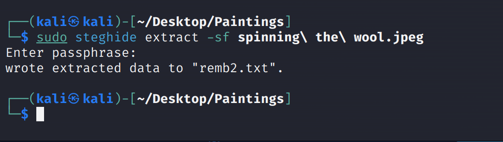

# mhz_cxf: c1f

> 靶机文档：：[mhz_cxf: c1f](https://www.vulnhub.com/entry/mhz_cxf-c1f,471/)
>
> 下载
>
> 地址：[**Download (Mirror)**: ](https://download.vulnhub.com/mhzcxf/mhz_c1f.ova.zip)

### 网卡配置

靶机开机后按住shift，出现界面如图，按e键进入安全模式：


**找到ro，删除该行后边内容，并将ro 。。。修改为：** `rw signie init=/bin/bash`


替换后


按`ctrl+x`进入bash

输入指令`ip a`查看当前网卡，除lo外的，记住名字


首先查看/etc/network/文件目录下是否有interfacers文件

如果没有interfaces文件或者文件内容为：


退出编译，查看/etc/netplan的内容：


看到`.yaml`文件，对其进行编辑，将框内内容改为`ip a`的网卡名称


保存之后直接重启系统，大功告成

### 信息收集

#### 主机发现

扫描C段

```
sudo nmap -sn 192.168.8.0/24 
```


#### 端口扫描

```bash
sudo nmap -sT --min-rate 10000 192.168.8.25
```


#### 详细信息扫描

```bash
sudo nmap -sT -sC -sV -O -p 22,80  192.168.8.25

-sC  使用默认脚本扫描
-sV 探测服务版本
-O 探测操作 系统版本
```


#### 漏洞脚本扫描

```bash
sudo nmap --script=vuln -p 22,80 192.168.8.25
```


并没有什么发现

访问一下`80`端口


#### 目录爆破

```bash
gobuster dir -u http://192.168.8.25 -w /usr/share/wordlists/dirbuster/directory-list-2.3-medium.txt -x php,txt,html
```


### 漏洞探测


访问`notes.txt`


访问`remb.txt`


`first_stage:flagitifyoucan1234`

猜测，这个可能就是一个用户名，对应着它的密码，

再访问看看`remb2.txt`


尝试`ssh`连接


成功进入，输入`bash`，回去有回显的shell


### 提权

拿到权限第一步`sudo -l`


再找找其他有用的信息吧！


在`mhz_c1f`目录下有四张图片


#### 图片隐写

先把他们下载到本地，再慢慢分析

```bash
sudo scp first_stage@192.168.8.25:/home/mhz_c1f/Paintings/* ./Paintings/
```


查看一下图片

```bash
xdg-open 19th\ century\ American.jpeg
```


是西方的几张油画，从视觉上来看，没有发现什么信息

再看一下文件中的信息是否有捆绑，或隐写之类的

```bash
file *.jpeg
```


都是`JPEG`的图形格式，没有问题

再看一下是否有捆绑

```bash
binwalk *.jpeg 
```


查看是否有隐写

```bash
steghide info 19th\ century\ American.jpeg
```


最后发现`spinning\ the\ wool.jpeg`这张图片是有内嵌 数据的

提权数据，从隐写文件里提取出来的文件，它需要创建文件，所以要给他`sudo 权限`

```bash
sudo steghide extract -sf spinning\ the\ wool.jpeg 
```




查看`remb2.txt`


得到 另一个用户的密码`mhz_c1f:1@ec1f`


查看它有哪些权限`sudo -l`


那就可以直接提权


### 总结

- 发现22、80端口开放，页面浏览没有有用的信息
- 目录爆破，gobuster指定扩展名发现notes.txt文件，暴露出remb.txt和remb2.txt
- 把remb.txt拼接到url中，看到了第一个凭据，ssh登陆
- 在信息枚举的过程中，发现了一个文件夹，有四张图片，发现spinning\ the\ wool.jpeg 有隐写信息
- 暴露出remb2.txt，得到第二个凭据
- mhz_c1f有root的全部权限，直接拿到root