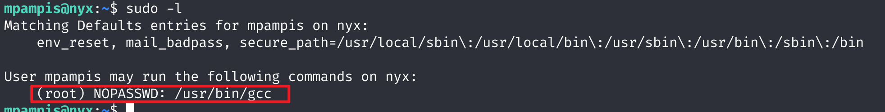

靶机地址：https://www.vulnhub.com/entry/nyx-1,535/

## 信息收集


详细信息扫描


指定默认漏洞脚本扫描


注意这里好像看到了一个web的目录：/d41d8cd98f00b204e9800998ecf8427e.php ，说实话还挺奇怪的，这么长的文件名都能暴露出来，访问能够发现是个私钥文件：


那这很可能就是ssh的私钥呀？至于是谁的私钥呢？注意看网页标题名称，mpampis key，那说不定就是mpampis的私钥。 当然，也可以看这个私钥最后的==判断是base64编码的形式，找个工具Base64解码一下也能看到mpampis字符串：


## ssh私钥登录获取初始立足点

把这个私钥复制下来，随便起个名字，我这里就命名为isa了：


注意既然是私钥，必须具有保密性，因此权限必须保证只有所有者能够拥有读（写）权限，否则无法利用私钥登录。因此我们修改这个私钥的权限为600（或400）：


然后尝试用登录mpampis的ssh，如下：

```bash
sudo ssh mpampis@172.16.31.9 -i isa
```


## sudo gcc提权

提权也是常规思路，先sudo -l查看有哪些特殊可利用的二进制可执行文件：



 gcc是常见的C语言编译工具，至于如何利用这个工具提权，可疑参考开源项目GTFOBins，详情见：[GTFOBins](https://gtfobins.github.io/)


 运行如下指令即可提权（sh和bash都可以，就是Shell的种类不同，bash交互性更好一些）：

```bash
sudo gcc -wrapper /bin/sh,-s .
```

> 用-wrapper指定包装器，在包装器中添加启动shell的指令，,-s是bash的参数，指定从标准输入读取命令，保证读取到EOF时不会退出，点.表示编译的内容，此时我们并不关心编译啥，随便给个当前目录.即可

