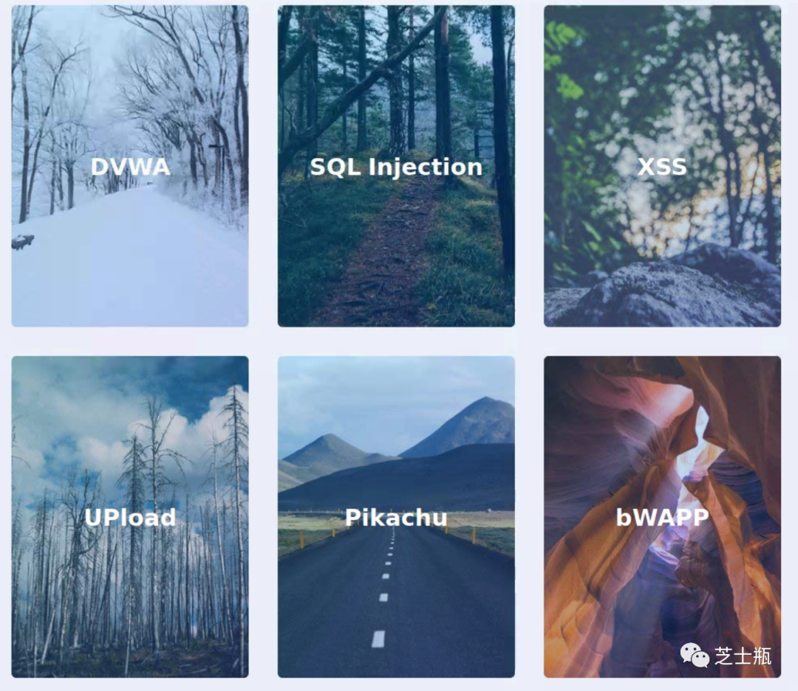
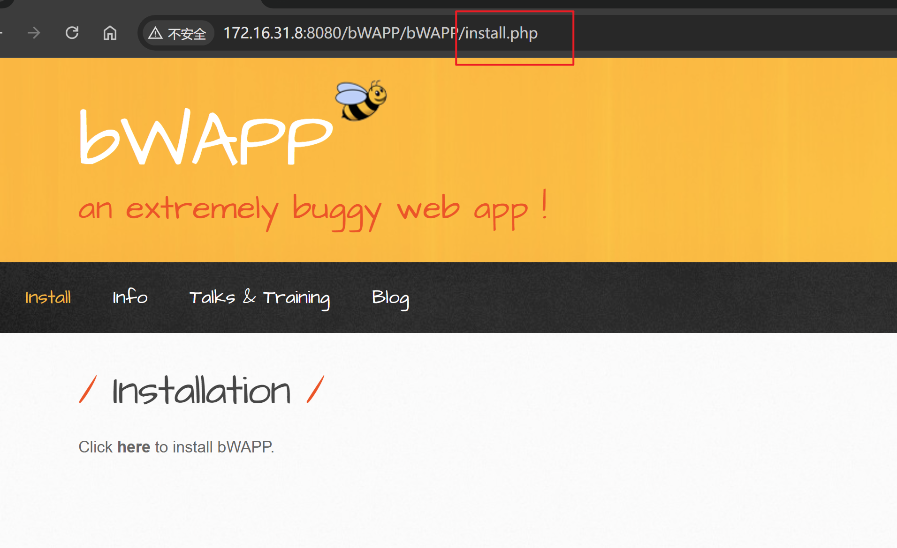

## Docker搭建6个常见靶场

**websec-labs**

一个集合了很多web安全漏洞靶场的github项目

websec-labs就是为此而诞生的！把6个常见web安全开源靶场项目（DVWA，SQLi-Labs,XSS-labs,Pikachu,bWAPP,Upload-labs）在docker中一键部署,使用方便快捷，并且不用担心被人通过本地漏洞植入木马等危害操作，让学习者把重心放在漏洞本身，而不是花费太多的精力在靶场部署上。

由Spe4r和温茶同学联合整理！



镜像拉取

```dockerfile
sudo docker pull jojosec/websec-labs:v2
```

启动websec-labs容器

```bash
sudo docker run -d -p 8080:80 [IMAGE ID]
```

访问http://127.0.0.1:8080 即可开启web安全训练之旅！

注意

bWAPP初次启动需要手动创建数据库

访问install.php创建数据库即可使用





enjoy~~~~