##### 路径遍历第二关

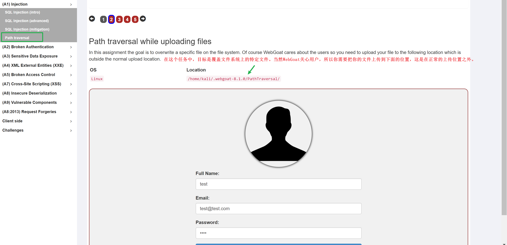

在正常上传的情况下，会上传到如下图的位置

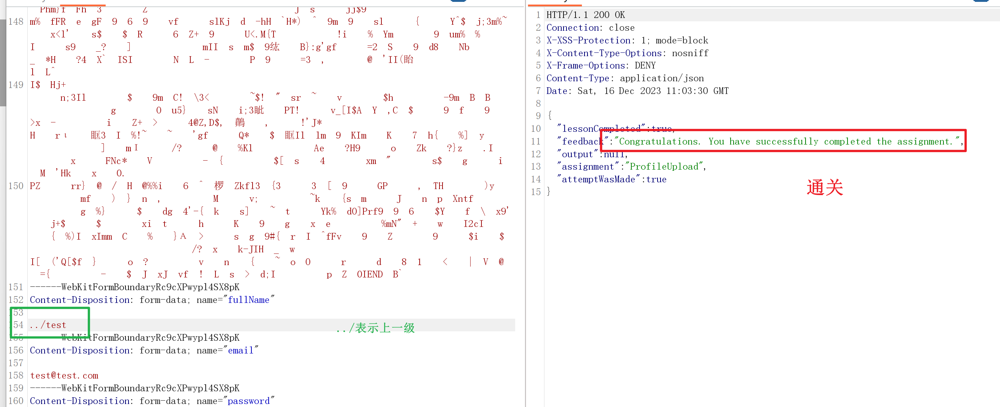

###### 源码分析

解压jar包

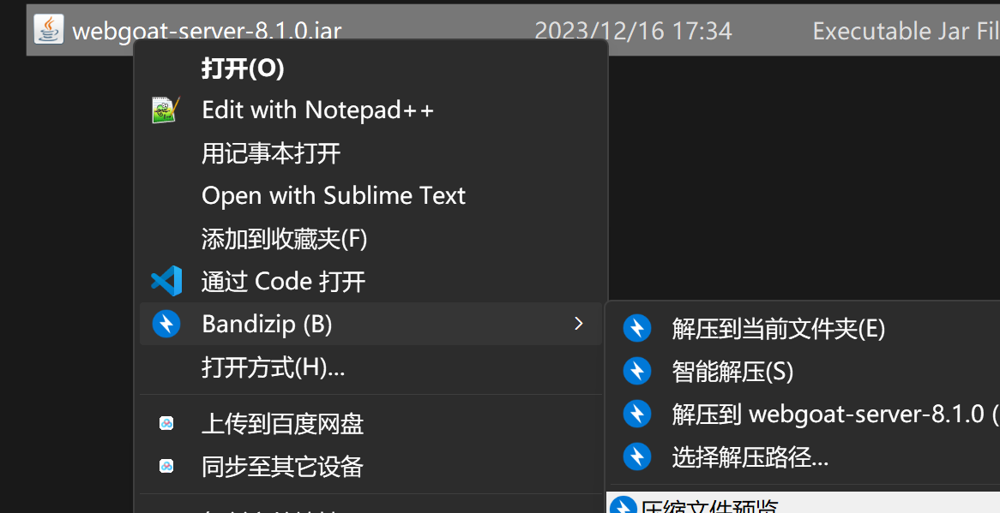

得到源码

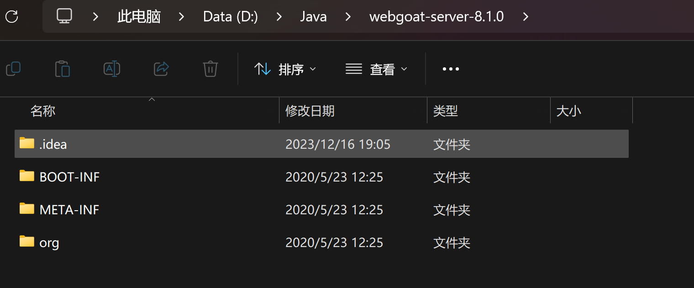

使用IDEA打开，进行分析

通过bp抓包得到的请求路径，找到其jar包

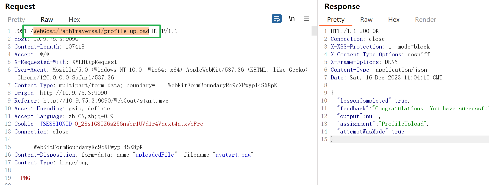

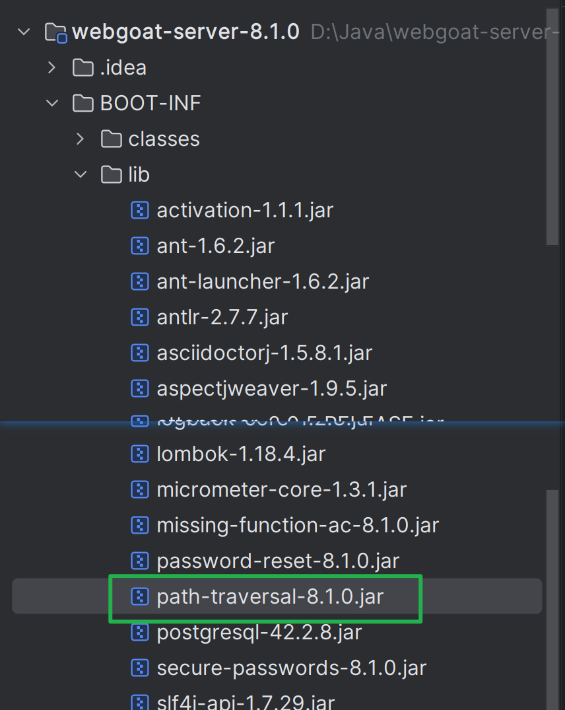

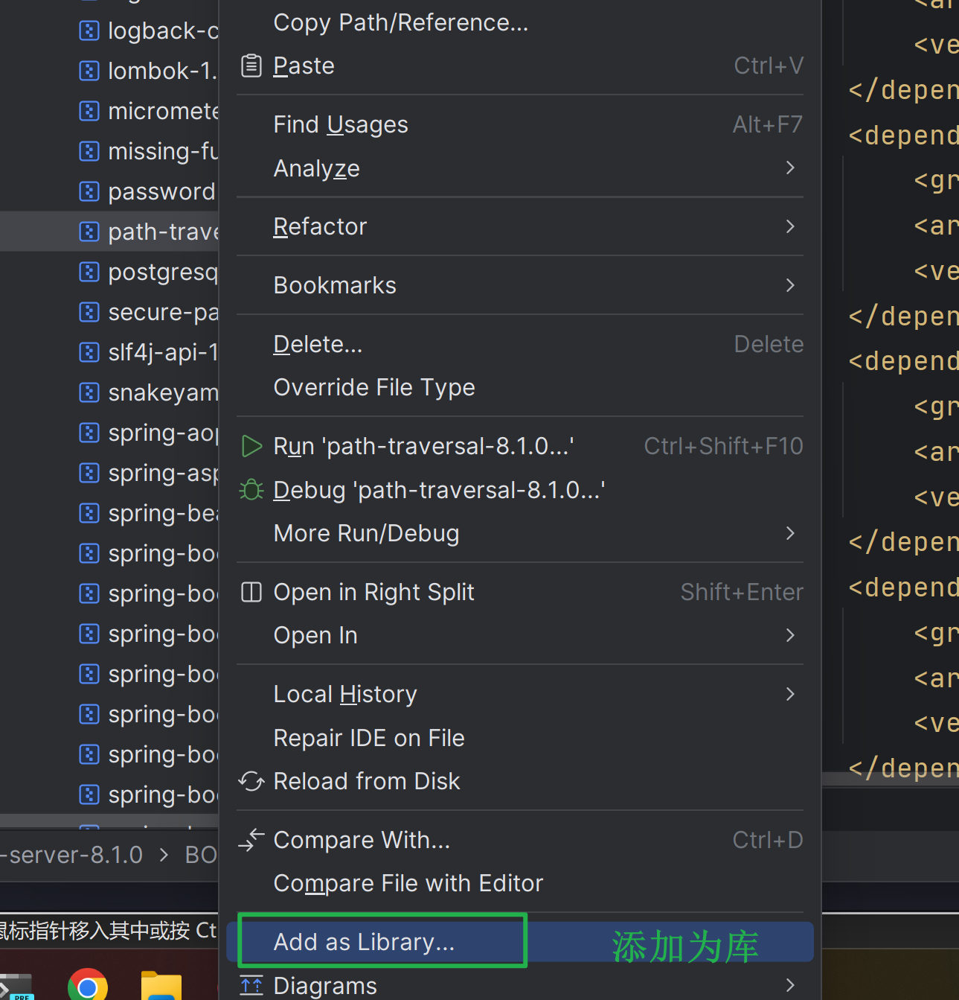

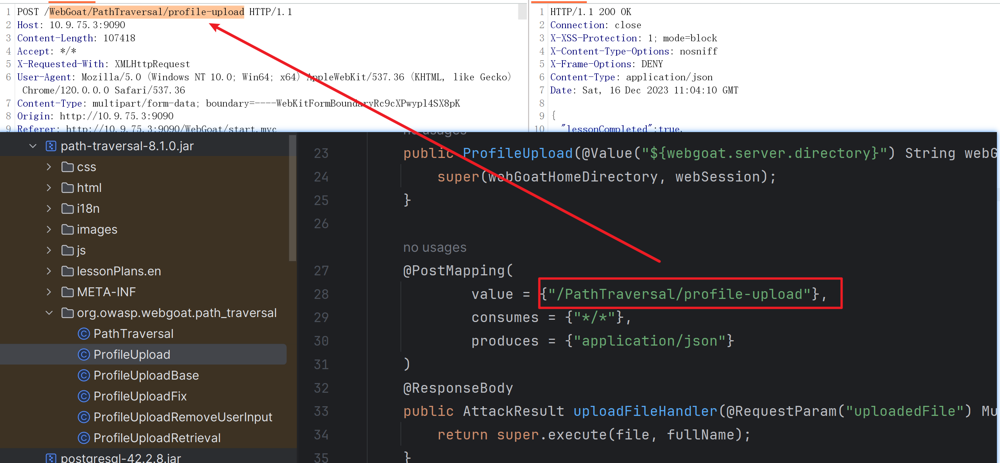

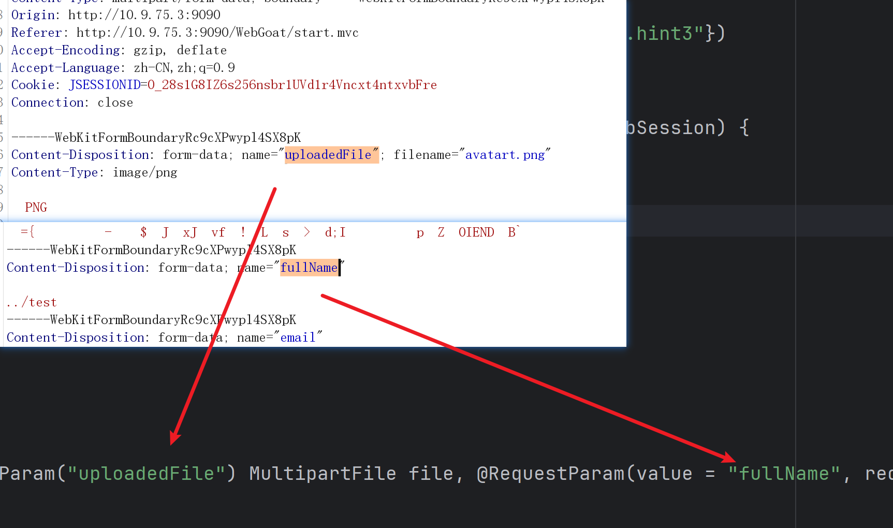

##### 路径遍历第三关

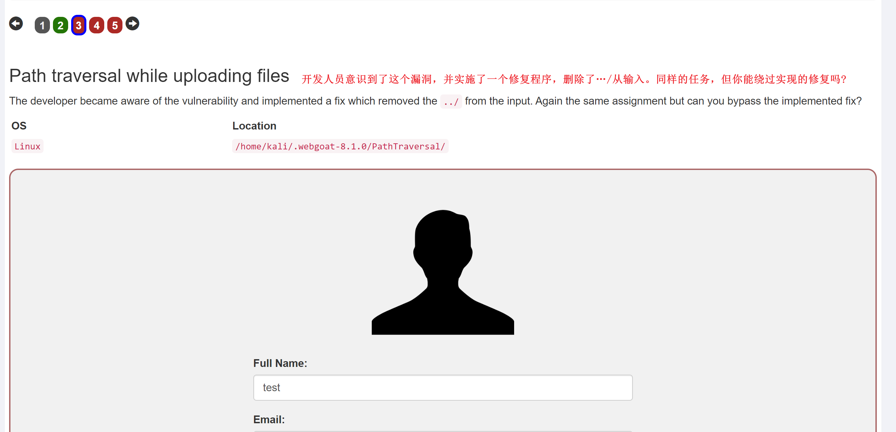

先上传一个图片，看其上传的路径

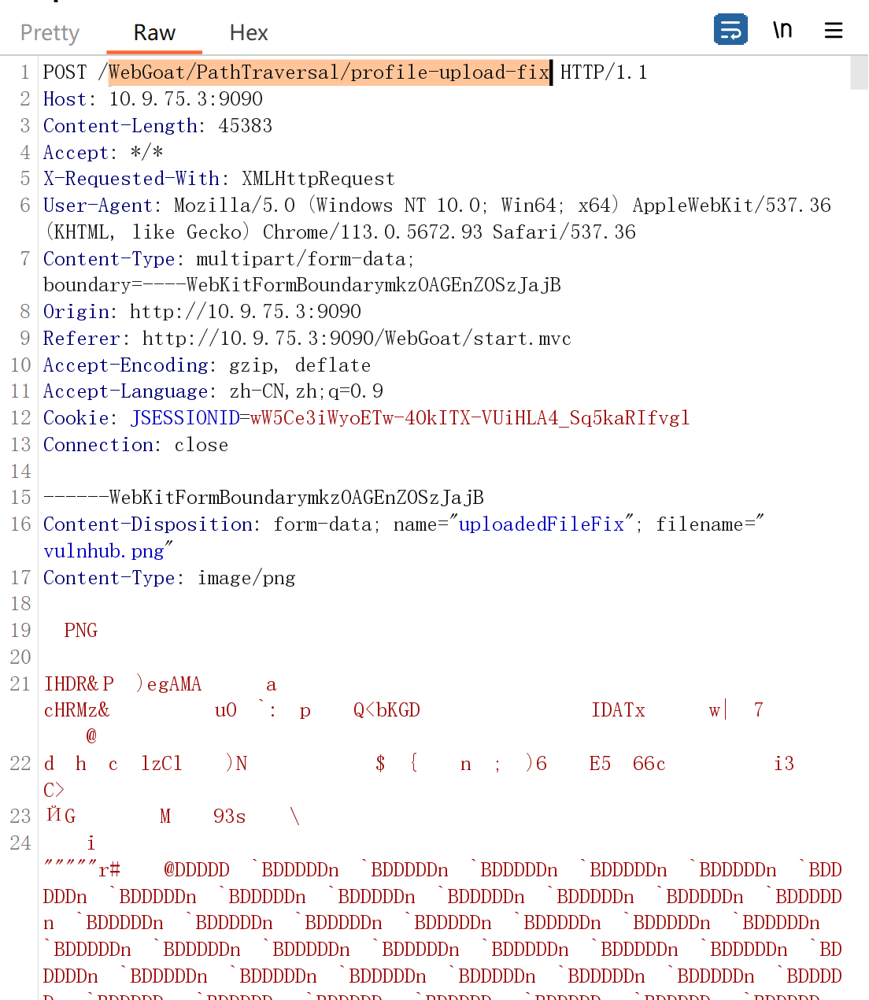

###### 源码分析

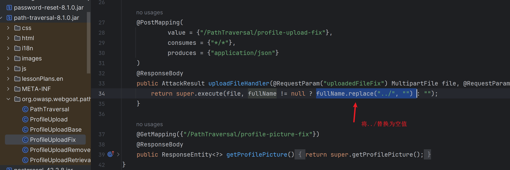

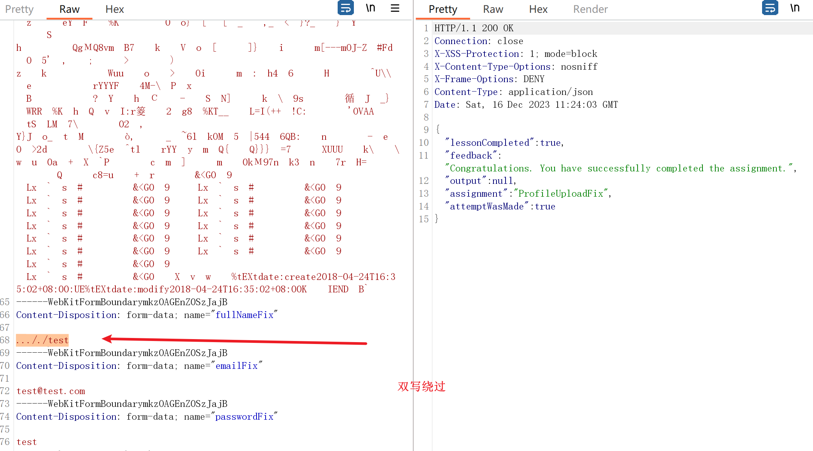

##### 认证绕过第二关

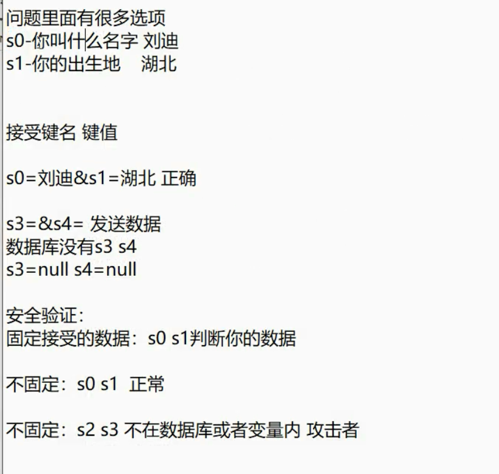

随便输入问题答案，提交

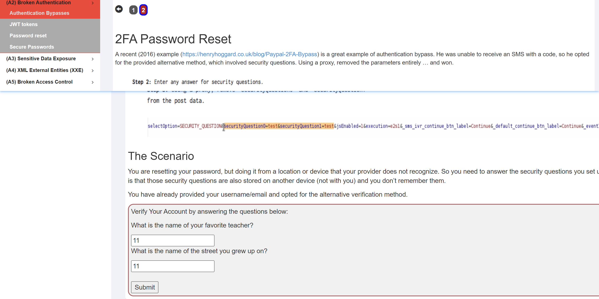

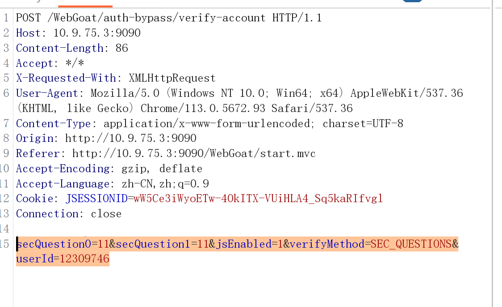

修改字段，绕过

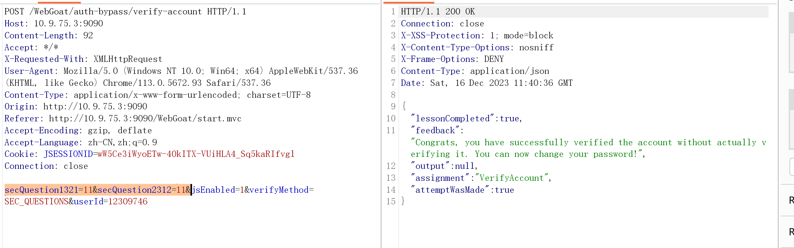

